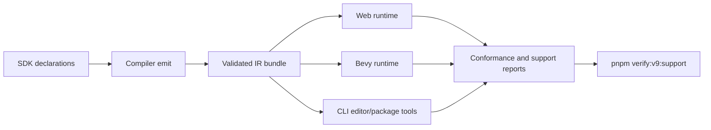
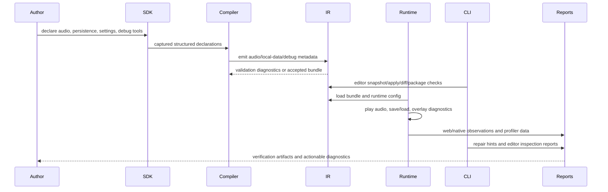

# V9-06 Audio, Persistence, and Tooling Support

Complexity: 13 -> HIGH mode

## Complexity Assessment

- +3 touches 10+ files during implementation
- +2 adds new support-track systems for persistence, diagnostics overlays, and
  editor panels
- +2 requires complex runtime state, save migration, autosave, and audio mixer
  behavior
- +2 spans SDK, IR, compiler, CLI, web runtime, Bevy runtime, examples, docs,
  and verification
- +2 adds user-facing editor/debug UI surfaces
- +2 adds broad release-gate and conformance evidence

This PRD is a broad support-track plan. It deliberately separates the work into
small vertical slices so each phase is implementable, reviewable, and
user-testable without requiring the entire support surface to land at once.

## Context

**Problem:** ThreeNative has early audio, editor, diagnostics, packaging, and
performance foundations, but practical games still lack real spatial/mixer
audio, local saves/settings, migration/autosave hooks, author-facing
inspector/debug tools, richer profiler/stress evidence, and stable repair
diagnostics.

**Files Analyzed:**

- `docs/bevy-feature-parity.md`
- `docs/PRDs/v8/README.md`
- `docs/PRDs/v8/V8-16-spatial-audio-mixer-and-music-transitions.md`
- `docs/PRDs/v8/V8-17-portable-save-slots-settings-local-data.md`
- `docs/PRDs/v8/V8-18-editor-debugging-diagnostics-packaging-performance-support.md`
- `docs/PRDs/v8/V8-15-rich-ui-text-accessibility-residuals.md`
- `docs/STATUS.md`
- `packages/sdk/src/audio.ts`
- `packages/ir/src/audio.test.ts`
- `packages/ir/src/editorProject.ts`
- `packages/ir/src/performanceProfile.ts`
- `packages/runtime-web-three/src/audio.ts`
- `runtime-bevy/crates/threenative_runtime/src/audio.rs`
- `scripts/verify-v7-audio-lifecycle-trace.mjs`
- `scripts/verify-v7-packaging-target-profiles.mjs`
- `scripts/verify-v7-performance-budgets.mjs`

No `.env*` files were found in the repo scan, and this PRD does not require
environment-specific configuration.

**Current Behavior:**

- Audio validates local OGG/WAV assets, logs deterministic playback commands,
  supports bus/listener/spatial-emitter metadata, and exposes playback-id
  controls, but real attenuation, mixer ducking/effects, pitch/tone playback,
  and state-driven soundtrack transitions are not promoted.
- Persistence/settings are not claimed: no portable save slots, local settings
  store, migration diagnostics, or autosave/checkpoint contract exists.
- Diagnostics already have stable JSON shapes, suggestions, paths, metadata,
  conformance reports, V7 packaging target diagnostics, and deterministic
  performance budgets, but not live profiler/GPU timing, in-app FPS/custom
  diagnostics, broad platform repair hints, stress fixtures, or stable
  unsupported networking/runtime diagnostics.
- The editor has local structured snapshots, apply, diff, and save/load round
  trips over bundle data, but no visual editor UI, inspector panels, property
  editing, scene viewer, asset preview, debug draw APIs, or hot reload policy.

## Impact

**Planned files touched by implementation:** SDK audio and future persistence
APIs, IR schemas/types/validators, compiler emit, CLI editor/package commands,
web runtime services, Bevy runtime services, conformance fixtures, examples,
verify scripts, and docs status/parity updates.

**Features affected:** runtime audio, script services, local data, settings UI,
editor tooling, diagnostics taxonomy, target profiles, package repair hints,
performance evidence, and V9 aggregate verification.

**Main risks:**

- The support surface is broad enough to become unreviewable if implemented as a
  single patch. Each phase below is a vertical slice with its own evidence gate.
- Persistence must not serialize runtime handles, renderer objects, platform
  paths, or undeclared script-local state.
- Audio parity must avoid claiming backend-specific effects that web and Bevy
  cannot both prove.
- Editor tools must operate on structured SDK/ECS/IR bundle data, not on raw
  Three.js or Bevy state as a new source of truth.
- Hot reload must be policy-first and diagnostic-first; state-preserving reload
  should only be claimed where deterministic evidence exists.

## Integration Points

**How will this feature be reached?**

- [x] Entry point identified: SDK audio/persistence/debug declarations,
  script service calls, `tn editor` commands, `tn package` diagnostics,
  runtime debug overlays, conformance fixtures, and `pnpm verify:v9:support`.
- [x] Caller file identified: SDK APIs, compiler emit, IR validation, web
  runtime service host, Bevy runtime service host, CLI command dispatcher, and
  verification scripts.
- [x] Registration/wiring needed: new IR documents or sections for local data
  and debug tools, audio mixer/music fields, service permissions, editor panel
  commands, diagnostics codes, fixtures, examples, docs, and release gates.

**Is this user-facing?**

- [x] YES. Game authors reach this through SDK declarations, script services,
  local save/settings APIs, editor/inspector commands, debug overlays, package
  repair hints, and verification artifacts.

**UI components required:**

- Visual editor shell panels for scene hierarchy, selected-entity properties,
  asset preview, scene viewer, and gamepad/device viewer.
- In-app debug overlay for FPS, frame budget, audio diagnostics, input/device
  diagnostics, save-slot status, and custom counters.
- Gizmo/debug draw overlays for transforms, bounds, lights, cameras, UI nodes,
  rays, lines, and labeled markers.
- Local settings UI fixture covering controls, audio, video, accessibility, and
  save-slot management.

**Full user flow:**

1. User authors a game with spatial audio, music transitions, declared
   persistent resources/components, local settings, and debug draw calls.
2. `tn build` captures SDK declarations, validates IR, rejects unsupported
   fields, and emits bundle-local audio/local-data/debug metadata.
3. `tn preview` or the web/native runtime loads the bundle, wires audio,
   local-data services, debug overlays, and editor inspection data.
4. User opens `tn editor` or a preview debug overlay, edits structured scene
   properties, inspects assets/devices, triggers save/load/autosave, and sees
   diagnostics/profiler data.
5. `pnpm verify:v9:support` builds the support example, runs focused
   conformance, captures web/native reports, and writes artifacts proving the
   promoted behavior.

## Solution

**Approach:**

- Promote one practical audio slice: true listener/emitter attenuation, routed
  buses, narrow ducking/effect diagnostics, pitch/generated tones, and
  state-driven music transitions with web/native evidence.
- Add local-only persistence: save slots, typed settings key/value storage,
  migration/version diagnostics, and checkpoint/autosave hooks for declared
  resources/components only.
- Add author-facing diagnostics: in-app FPS/custom counters, debug draw APIs,
  platform audio diagnostics, stable unsupported-feature/networking diagnostic
  codes, target-profile repair hints, and large-scene stress reports.
- Extend local editor support with visual inspector panels, scene hierarchy,
  property editing, asset preview, scene viewer, gamepad viewer, gizmo overlays,
  and a diagnostic-first hot reload policy.
- Prove support behavior through a narrow V9 example, conformance fixture,
  runtime tests, screenshot/report artifacts, and aggregate docs guards.



**Key Decisions:**

- [x] Use existing SDK/IR/compiler/runtime package boundaries instead of a
  standalone support subsystem.
- [x] Keep persistence local-only and declarative; no cloud save, accounts, raw
  filesystem access from scripts, or opaque runtime-handle serialization.
- [x] Treat unsupported networking/multiplayer/replication declarations as
  stable diagnostics, not runtime networking parity.
- [x] Keep editor state subordinate to structured bundle documents and existing
  `tn editor snapshot/apply/diff` flows.
- [x] Prefer deterministic report artifacts for automated gates; live profiler
  captures may be report-only where host support varies.

**Data Changes:**

- `audio.ir.json`: attenuation curves, listener binding, bus routing, ducking,
  pitch, generated tone descriptors, music transition rules, and diagnostic
  capability metadata.
- New or extended local-data IR: save-slot schema, persisted resource/component
  whitelist, settings keys, migration version, autosave/checkpoint declarations,
  and corrupt-save repair diagnostics.
- Editor/debug metadata: inspector tree nodes, editable property descriptors,
  debug draw declarations, overlay counters, viewer reports, and hot reload
  policy results.
- Target/profile diagnostics: repair hints, unsupported feature categories,
  unsupported networking categories, stress fixture reports, live/native/GPU
  profiler report metadata.

## Sequence Flow



## Execution Phases

#### Phase 1: Spatial Audio and Music Slice - Moving listener/emitter data changes audible output and state changes transition music

**Files (max 5):**

- `packages/sdk/src/audio.ts` - add authoring declarations for attenuation,
  listener binding, pitch, generated tones, and music transitions
- `packages/ir/src/audio.ts` - validate audio routing, attenuation, pitch,
  generated tones, and transition metadata
- `packages/compiler/src/emit/audio.ts` - emit the promoted audio shape from
  SDK capture
- `packages/runtime-web-three/src/audio.ts` - map the promoted fields to web
  audio graph observations
- `runtime-bevy/crates/threenative_runtime/src/audio.rs` - map the same fields
  to Bevy audio observations and diagnostics

**Implementation:**

- [ ] Add bounded attenuation curves: `linear`, `inverse`, and `exponential`
  with `minDistance`, `maxDistance`, and `rolloffFactor`.
- [ ] Bind listeners to active camera or an explicit entity transform and record
  listener movement observations.
- [ ] Add routed buses with gain, mute, solo, child bus routing, and one
  portable ducking rule shape.
- [ ] Add pitch scalar and generated tone playback for sine/square/noise test
  tones with bounded duration and volume.
- [ ] Add music transition rules for app states: intro, loop, crossfade, and
  stinger with deterministic playback IDs.
- [ ] Reject streaming/network audio, platform-native audio handles, arbitrary
  decoder plugins, and unsupported effect chains with stable diagnostics.

**Tests Required:**

| Test File | Test Name | Assertion |
| --- | --- | --- |
| `packages/sdk/src/audio.test.ts` | `should capture attenuation and music transitions when audio declarations are valid` | Captured declarations include listener, emitter, bus, pitch, tone, and transition fields |
| `packages/ir/src/audio.test.ts` | `should reject streaming audio when portable audio only allows bundle-local sources` | Validator returns a stable unsupported-streaming diagnostic |
| `packages/compiler/src/emit/audio.test.ts` | `should emit routed audio and generated tone metadata when declared in SDK` | `audio.ir.json` matches expected stable JSON |
| `packages/runtime-web-three/src/audio.test.ts` | `should report attenuation and ducking observations when listener moves` | Web observation report includes changing gain and active ducking |
| `runtime-bevy/crates/threenative_runtime/tests/audio.rs` | `should report matching audio support diagnostics when effect is unsupported` | Native diagnostics use the same code and path as IR/web |

**Verification Plan:**

1. **Unit Tests:** Run SDK, IR, compiler, web runtime, and Bevy audio tests
   listed above.
2. **Integration Test:** Add a `v9-audio-support` conformance fixture with one
   moving listener, two emitters, one music transition, and one generated tone.
3. **Runtime Proof:** Add `scripts/verify-v9-audio-support.mjs` to build the
   fixture, run web/native traces, compare observations, and write
   `artifacts/v9/audio-support/verification-report.json`.
4. **Evidence Required:** report contains listener movement, attenuation values,
   bus routing, ducking, pitch/tone metadata, transition lifecycle, and
   unsupported streaming/network diagnostics.

**User Verification:**

- Action: Run `pnpm verify:v9:audio-support`.
- Expected: The report shows matching web/native audio observations and stable
  diagnostics for deliberately unsupported audio declarations.

**Checkpoint:**

- Automated: Spawn `prd-work-reviewer` with prompt
  `Review checkpoint for phase 1 of PRD at docs/PRDs/v9/V9-06-audio-persistence-tooling-support.md`.
- Manual: Listen to the support scene in web preview and native preview; moving
  away from emitters lowers apparent volume and state changes crossfade music.

#### Phase 2: Local Save Slots and Settings - A game can persist declared progress and settings locally

**Files (max 5):**

- `packages/sdk/src/persistence.ts` - add save-slot, settings, migration, and
  checkpoint authoring APIs
- `packages/ir/src/persistence.ts` - validate local-data schemas, whitelist,
  setting keys, and migration metadata
- `packages/compiler/src/emit/persistence.ts` - emit local-data IR from SDK
  declarations and script permissions
- `packages/runtime-web-three/src/systems/services/persistence.ts` - implement
  web local storage/indexed local backend service observations
- `runtime-bevy/crates/threenative_runtime/src/persistence.rs` - implement
  native local file-backed service observations

**Implementation:**

- [ ] Add explicit `persist.resource`, `persist.component`, and
  `persist.setting` declarations with schema-backed primitive/object values.
- [ ] Add save-slot metadata: slot ID, display name, app version, schema
  version, timestamp, play time, screenshot ref optional, and checksum.
- [ ] Add settings groups for controls, audio, video, and accessibility,
  including default values, min/max validation, enum values, and import/export.
- [ ] Add script services for list slots, save, load, delete, export settings,
  import settings, and read/write setting values.
- [ ] Add migration diagnostics for missing migrator, forward-incompatible save,
  corrupt payload, checksum mismatch, unknown persisted field, and rejected
  runtime handle.
- [ ] Add checkpoint/autosave lifecycle hooks with debounce, fixed schedule
  timing, and explicit failure events.

**Tests Required:**

| Test File | Test Name | Assertion |
| --- | --- | --- |
| `packages/sdk/src/persistence.test.ts` | `should capture save slots and settings when declarations are schema backed` | SDK output includes whitelist and settings defaults |
| `packages/ir/src/persistence.test.ts` | `should reject runtime handles when save data is not portable` | Validator returns a stable nonportable-save diagnostic |
| `packages/compiler/src/emit/persistence.test.ts` | `should emit local data IR when resources and components are persisted` | Bundle contains deterministic local-data JSON |
| `packages/runtime-web-three/src/systems/services/persistence.test.ts` | `should restore declared resources when save slot is loaded` | Web service trace restores whitelisted values only |
| `runtime-bevy/crates/threenative_runtime/tests/persistence.rs` | `should report migration diagnostics when save version is unsupported` | Native report includes matching migration code and repair hint |

**Verification Plan:**

1. **Unit Tests:** SDK/IR/compiler/local persistence service tests for accepted
   and rejected declarations.
2. **Integration Test:** Add a `v9-local-data-support` fixture that saves player
   progress, audio/input settings, and accessibility settings, then reloads.
3. **Runtime Proof:** Add `scripts/verify-v9-local-data-support.mjs` to run
   web/native save/load/migration traces and write
   `artifacts/v9/local-data-support/verification-report.json`.
4. **Manual Verification:** In the support example, change audio volume and
   input binding, save a slot, reload preview, and confirm both settings and
   declared progress restore.
5. **Evidence Required:** report proves local-only boundary, save slot metadata,
   settings round trip, migration diagnostics, corrupt-save diagnostics, and
   checkpoint/autosave lifecycle events.

**User Verification:**

- Action: Run `pnpm verify:v9:local-data-support` and open the support preview.
- Expected: Save slots and settings round trip locally; cloud/account storage is
  absent and unsupported cloud fields fail with actionable diagnostics.

**Checkpoint:**

- Automated: Spawn `prd-work-reviewer` with prompt
  `Review checkpoint for phase 2 of PRD at docs/PRDs/v9/V9-06-audio-persistence-tooling-support.md`.
- Manual: Change settings and save/load a slot in the preview; verify the
  restored state is visible after a runtime restart.

#### Phase 3: Runtime Diagnostics and Debug Draw - Authors can see FPS, custom counters, and gameplay debug geometry

**Files (max 5):**

- `packages/sdk/src/debug.ts` - add debug draw, FPS overlay, custom diagnostic,
  and platform diagnostic declarations
- `packages/ir/src/runtimeDiagnostics.ts` - validate debug draw and diagnostic
  report shapes
- `packages/runtime-web-three/src/debugOverlay.ts` - render FPS/custom
  diagnostics and debug draw in web preview
- `runtime-bevy/crates/threenative_runtime/src/debug_overlay.rs` - render or
  report equivalent debug draw/FPS diagnostics in native preview
- `scripts/verify-v9-diagnostics-support.mjs` - collect overlay, unsupported
  feature, and platform diagnostic artifacts

**Implementation:**

- [ ] Add debug draw APIs for line, ray, bounds, sphere, box, text label,
  transform axes, camera frustum, light volume, UI node rectangle, and lifetime.
- [ ] Add in-app FPS overlay and custom diagnostic counters with severity,
  source path, category, and frame/window aggregation.
- [ ] Add platform audio diagnostics for missing audio device, unsupported
  decoder, autoplay blocked, unavailable spatial backend, and effect fallback.
- [ ] Add stable unsupported-feature diagnostics for advanced renderer,
  material, runtime declaration, raw platform API, DOM, filesystem, and custom
  loader usage.
- [ ] Add stable unsupported-networking diagnostics for websocket, multiplayer,
  replication, prediction, server authority, and online presence declarations.
- [ ] Keep networking as rejected/diagnosed scope only; do not add runtime
  networking services.

**Tests Required:**

| Test File | Test Name | Assertion |
| --- | --- | --- |
| `packages/sdk/src/debug.test.ts` | `should capture debug draw calls when gameplay systems declare diagnostics` | SDK capture includes lines, bounds, labels, and counters |
| `packages/ir/src/runtimeDiagnostics.test.ts` | `should reject networking declarations with stable diagnostics when networking is out of scope` | Diagnostics include code, severity, path, and suggestion |
| `packages/runtime-web-three/src/debugOverlay.test.ts` | `should render FPS and custom diagnostic entries when overlay is enabled` | Overlay model includes expected counters and severity rows |
| `runtime-bevy/crates/threenative_runtime/tests/debug_overlay.rs` | `should report debug draw observations when native overlay is enabled` | Native report preserves draw primitive IDs and labels |
| `scripts/verify-v9-diagnostics-support.test.mjs` | `should fail when required diagnostic artifact is missing` | Verify script reports missing artifact with `TN_VERIFY_V9_*` |

**Verification Plan:**

1. **Unit Tests:** Debug API, diagnostics validation, web overlay, and native
   overlay/report tests.
2. **Integration Test:** Add a diagnostics fixture that draws colliders, rays,
   UI bounds, light volumes, and custom counters while also including rejected
   unsupported networking/material/runtime declarations.
3. **Runtime Proof:** Run `pnpm verify:v9:diagnostics-support` to capture
   screenshot/report artifacts under `artifacts/v9/diagnostics-support/`.
4. **Evidence Required:** artifacts include FPS/custom counters, debug draw
   observations, platform audio diagnostics, unsupported-feature diagnostics,
   and unsupported-networking diagnostics.

**User Verification:**

- Action: Open the support preview with diagnostics enabled.
- Expected: FPS, custom counters, debug geometry, and repair diagnostics are
  visible without changing gameplay source of truth.

**Checkpoint:**

- Automated: Spawn `prd-work-reviewer` with prompt
  `Review checkpoint for phase 3 of PRD at docs/PRDs/v9/V9-06-audio-persistence-tooling-support.md`.
- Manual: Inspect web/native overlay screenshots and confirm text does not
  overlap or hide critical gameplay controls.

#### Phase 4: Editor Inspector and Viewer Tools - Authors can inspect and edit structured scene data

**Files (max 5):**

- `packages/cli/src/index.ts` - add editor command wiring for inspect, set,
  viewer, asset preview, and hot reload policy checks
- `packages/ir/src/editorProject.ts` - extend structured snapshot data with
  inspector tree, editable property descriptors, and diagnostics
- `packages/runtime-web-three/src/editor/inspector.ts` - provide local visual
  panels for hierarchy, properties, scene viewer, asset preview, and gamepad
  viewer
- `packages/runtime-web-three/src/gizmoGeometry.ts` - compose existing gizmo
  helpers into editor overlays for transforms, lights, bounds, cameras, and UI
  nodes
- `scripts/verify-v9-editor-support.mjs` - verify editor reports, screenshots,
  and structured round trips

**Implementation:**

- [ ] Add `tn editor inspect --bundle <path>` to emit scene hierarchy,
  component/property descriptors, asset refs, diagnostics, and editable paths.
- [ ] Add `tn editor set --bundle <path> --path <json-path> --value <json>` to
  apply one validated property edit through structured snapshot/apply plumbing.
- [ ] Add local editor panels for hierarchy, selected property editing, scene
  viewer, asset preview, and gamepad/device viewer.
- [ ] Add gizmo overlays for transform axes, bounds, cameras, lights, and UI
  nodes by reusing existing debug/editor-only geometry helpers.
- [ ] Add hot reload policy diagnostics: `reloadFull`, `reloadAssetsOnly`,
  `reloadRejected`, and `statePreservingUnavailable`, with explicit invalidation
  reasons.
- [ ] Ensure all editor writes route through bundle validation and never use
  raw Three.js or Bevy runtime state as a source of truth.

**Tests Required:**

| Test File | Test Name | Assertion |
| --- | --- | --- |
| `packages/cli/src/index.test.ts` | `should inspect scene hierarchy when bundle is valid` | CLI emits deterministic hierarchy and editable property paths |
| `packages/ir/src/editorProject.test.ts` | `should reject property edit when path targets runtime-only data` | Validator returns editor property diagnostic |
| `packages/runtime-web-three/src/editor/inspector.test.ts` | `should render inspector panels from structured snapshot data` | Panel model includes hierarchy, properties, asset preview, and viewer tabs |
| `packages/runtime-web-three/src/gizmoGeometry.test.ts` | `should build editor gizmos for cameras lights bounds and ui nodes` | Gizmo geometry is deterministic and color coded |
| `scripts/verify-v9-editor-support.test.mjs` | `should verify editor screenshot and structured diff artifacts` | Verify script enforces report and screenshot presence |

**Verification Plan:**

1. **Unit Tests:** CLI inspect/set, editorProject validation, inspector panel
   model, and gizmo composition tests.
2. **Integration Test:** Use a `v9-editor-support` fixture with nested
   hierarchy, lights, cameras, UI nodes, audio emitters, persistent data, and
   gamepad controls.
3. **Runtime Proof:** Run `pnpm verify:v9:editor-support` to capture inspector
   JSON, structured before/after diff, panel screenshot, scene viewer
   screenshot, asset preview report, and gamepad viewer report under
   `artifacts/v9/editor-support/`.
4. **Evidence Required:** the edit round trip modifies only structured bundle
   data, validates before save, and emits repair hints for hot reload policy
   rejections.

**User Verification:**

- Action: Run `tn editor inspect` then `tn editor set` on the support bundle and
  open the local editor preview.
- Expected: The changed property appears in hierarchy/properties panels, the
  structured diff is deterministic, and invalid hot reload attempts explain how
  to recover.

**Checkpoint:**

- Automated: Spawn `prd-work-reviewer` with prompt
  `Review checkpoint for phase 4 of PRD at docs/PRDs/v9/V9-06-audio-persistence-tooling-support.md`.
- Manual: Inspect editor screenshots on desktop and mobile widths; controls and
  panel text must not overlap.

#### Phase 5: Target Profiles, Stress Fixtures, and Profiler Evidence - Support risks are measured and repair hints are actionable

**Files (max 5):**

- `packages/ir/src/performanceProfile.ts` - extend target profiles with
  support-track repair hints and profiler report metadata
- `packages/cli/src/diagnostics.ts` - normalize platform/package repair hints
  for unsupported or incomplete target profiles
- `scripts/verify-v9-stress-support.mjs` - generate large-scene stress reports
  and profiler artifacts
- `packages/ir/fixtures/conformance/v9-support-stress/game.bundle/target.profile.json` - add stress target profile fixture
- `examples/v9-support/src/game.ts` - author the large-scene support fixture

**Implementation:**

- [ ] Add target profile categories for desktop web, desktop native, local
  editor, diagnostics overlay, local data, and audio capability requirements.
- [ ] Add repair hints for missing audio backend, unsupported profile target,
  package asset gap, unsupported overlay host, missing save directory, and
  insufficient graphics capability.
- [ ] Add stress fixtures for retained UI, text, lights, cubes, animated
  models, audio emitters, save slots, debug draw, and inspector hierarchy size.
- [ ] Add live/native profiler report metadata where practical: frame time,
  update time, render time, draw count, entity count, audio voice count, save
  latency, UI node count, and memory estimate.
- [ ] Add GPU/render-pass timing report fields as optional capability-gated
  evidence. Missing GPU timing support should warn with a repair hint, not fail
  the whole gate unless the target profile requires it.
- [ ] Keep signed installers, app-store/mobile packaging, hosted publishing,
  and online services outside this PRD.

**Tests Required:**

| Test File | Test Name | Assertion |
| --- | --- | --- |
| `packages/ir/src/performanceProfile.test.ts` | `should validate support profile repair hints when target capability is missing` | Profile diagnostics include target, missing capability, and suggestion |
| `packages/cli/src/diagnostics.test.ts` | `should format package repair hints when support artifact cannot be produced` | CLI diagnostic has stable code and artifact path |
| `scripts/verify-v9-stress-support.test.mjs` | `should fail when stress report omits required UI light cube or animation metrics` | Verify script reports missing metric |
| `packages/runtime-web-three/src/performanceMetrics.test.ts` | `should include support overlay metrics when diagnostics are enabled` | Web metrics include UI/debug/audio/local-data counts |
| `runtime-bevy/crates/threenative_runtime/tests/conformance.rs` | `should preserve support profiler fields in native conformance report` | Native report includes required profiler fields or capability warning |

**Verification Plan:**

1. **Unit Tests:** Target profile, CLI diagnostics, verify script, web metrics,
   and native conformance report tests.
2. **Integration Test:** Build `examples/v9-support`, run the stress fixture,
   and collect web/native profiler-like metrics.
3. **Runtime Proof:** Run `pnpm verify:v9:stress-support`; write reports under
   `artifacts/v9/stress-support/` and include large-scene metrics plus repair
   hint coverage.
4. **Evidence Required:** deterministic reports for UI, text, lights, cubes,
   animated models, audio emitters, save latency, debug draw volume, and target
   repair diagnostics.

**User Verification:**

- Action: Run `pnpm verify:v9:stress-support`.
- Expected: Stress reports are produced with stable budgets and repair hints;
  unsupported GPU timing appears as a capability warning unless required.

**Checkpoint:**

- Automated: Spawn `prd-work-reviewer` with prompt
  `Review checkpoint for phase 5 of PRD at docs/PRDs/v9/V9-06-audio-persistence-tooling-support.md`.
- Manual: Review web/native stress screenshots and profiler summaries for
  obvious blank render, missing overlay, or unusable inspector state.

#### Phase 6: Aggregate Gate and Docs Consistency - V9 support claims are proven and tracked

**Files (max 5):**

- `scripts/check-docs-v9.mjs` - enforce V9 support PRD/status/parity links and
  checklist drift
- `scripts/verify-v9-support.mjs` - aggregate audio, local data, diagnostics,
  editor, and stress verification
- `docs/STATUS.md` - update current support status after implementation lands
- `docs/bevy-feature-parity.md` - check promoted checklist items and document
  residual gaps after implementation lands
- `docs/PRDs/v9/README.md` - register V9-06 and release-gate commands after V9
  index exists

**Implementation:**

- [ ] Add V9 docs guard that requires this PRD, support example, verify scripts,
  artifact paths, status updates, and parity checklist updates.
- [ ] Add aggregate `pnpm verify:v9:support` that runs focused support gates and
  writes `artifacts/v9/support/verification-report.json`.
- [ ] Update status/parity docs only when implementation proves each checklist
  item; do not check off planned-only items.
- [ ] Record residual gaps, known target warnings, and explicit deferrals.
- [ ] Keep V9-06 independent from online project/publishing work unless a later
  V9 PRD explicitly depends on it.

**Tests Required:**

| Test File | Test Name | Assertion |
| --- | --- | --- |
| `scripts/check-docs-v9.test.mjs` | `should require support PRD links and artifact paths when V9 support gate is present` | Docs guard fails on missing status/parity references |
| `scripts/verify-v9-support.test.mjs` | `should aggregate support phase reports into one verification report` | Aggregate report links every required phase report |
| `scripts/verify-conformance.test.mjs` | `should include V9 support fixtures when support gate is enabled` | Conformance catalog contains V9 support fixtures |
| `packages/ir/src/contractDrift.test.ts` | `should reject unchecked support checklist drift when claimed in status` | Claimed support rows require matching schema/runtime evidence |
| `packages/compiler/src/examples.test.ts` | `should build the V9 support example without nonportable fields` | Example bundle validates and contains expected support IR |

**Verification Plan:**

1. **Unit Tests:** Docs guard, aggregate verify script, conformance catalog,
   contract drift, and example build tests.
2. **Integration Test:** Run `pnpm verify:v9:support` from a clean checkout.
3. **Runtime Proof:** Aggregate report links all phase artifacts and includes
   status for manual checkpoints.
4. **Evidence Required:** docs, parity, status, conformance, example, and
   artifact paths agree on what V9-06 promotes and what remains deferred.

**User Verification:**

- Action: Run `pnpm verify:v9:support`.
- Expected: A single support verification report links all promoted audio,
  local-data, diagnostics, editor, and stress evidence.

**Checkpoint:**

- Automated: Spawn `prd-work-reviewer` with prompt
  `Review checkpoint for phase 6 of PRD at docs/PRDs/v9/V9-06-audio-persistence-tooling-support.md`.
- Manual: Review `docs/STATUS.md` and `docs/bevy-feature-parity.md` to confirm
  checked items reflect shipped evidence, not planned intent.

## Checklist Coverage

**Covered by this PRD:**

- `P1` real 3D spatial attenuation and listener movement
- `P1` mixer buses, effects diagnostics, ducking, and routing behavior
- `P2` pitch control and generated tone playback
- `P1` soundtrack/state-driven music transitions
- `P2` platform-specific audio diagnostics
- `P1` portable save slots for declared resources/components
- `P1` local settings/key-value persistence for controls, audio, video, and
  accessibility options
- `P2` save migration/version metadata and diagnostics
- `P2` checkpoint/autosave lifecycle hooks
- `P2` live profiler captures and native platform profiler evidence
- `P2` GPU profiling and render-pass timing breakdowns as capability-gated
  report fields
- `P1` in-app FPS overlay and custom diagnostics
- `P1` broader platform target profiles and repair hints
- `P1` large-scene stress-test fixtures for UI, text, lights, cubes, and
  animated models
- `P1` stable unsupported-feature diagnostics for advanced renderer, material,
  and runtime declarations
- `P1` stable unsupported-networking diagnostics for multiplayer, websocket, and
  replication declarations
- `P1` visual editor UI and inspector panels
- `P1` scene hierarchy inspector and property editing
- `P2` gizmo overlays for transforms, lights, bounds, cameras, and UI nodes
- `P1` gamepad, scene viewer, and asset preview tools
- `P2` hot reload with state policy
- `P1` debug draw APIs for gameplay systems
- Related residuals: UI debug overlay/gizmos, picking debug overlay, light
  gizmos/debug visualization, residual camera diagnostics/editor tooling, and
  richer device diagnostics overlays/repair hints where they are part of the
  shared debug/editor surface.

**Explicitly deferred:**

- Cloud save and account-bound storage integration.
- Streaming/network audio and custom audio source/decoder support.
- Runtime networking, multiplayer, websocket transport, replication, prediction,
  server authority, online presence, collaboration, and hosted services.
- Signed installers, app-store/mobile packaging, and online publishing.
- Public plugin APIs, raw Three.js authoring, direct Bevy authoring, and broad
  shader graph/custom renderer promotion.

## Verification Strategy

**Core Commands:**

```bash
pnpm test
pnpm verify:conformance
pnpm verify:v9:audio-support
pnpm verify:v9:local-data-support
pnpm verify:v9:diagnostics-support
pnpm verify:v9:editor-support
pnpm verify:v9:stress-support
pnpm verify:v9:support
```

**Required Evidence:**

- Unit tests for every new SDK, IR, compiler, CLI, web runtime, and Bevy runtime
  surface.
- Conformance fixtures for audio support, local data, diagnostics/debug draw,
  editor inspection, and stress/profiler evidence.
- Web and native observation reports for promoted runtime behavior.
- Screenshot artifacts for editor panels, scene viewer, asset preview, debug
  overlays, and stress scenes.
- Stable diagnostics for unsupported audio, unsupported networking, unsupported
  runtime/platform APIs, save migration failures, package target issues, and
  hot reload policy rejections.
- Aggregate V9 support report linking all artifacts.

**Verification Evidence Template:**

```markdown
## Verification Evidence

### Phase 1: Spatial Audio and Music Slice
- Unit tests: pending
- Runtime proof: pending
- Manual audio pass: pending
- Checkpoint review: pending

### Phase 2: Local Save Slots and Settings
- Unit tests: pending
- Runtime proof: pending
- Manual save/load pass: pending
- Checkpoint review: pending

### Phase 3: Runtime Diagnostics and Debug Draw
- Unit tests: pending
- Runtime proof: pending
- Manual overlay pass: pending
- Checkpoint review: pending

### Phase 4: Editor Inspector and Viewer Tools
- Unit tests: pending
- Runtime proof: pending
- Manual editor pass: pending
- Checkpoint review: pending

### Phase 5: Target Profiles, Stress Fixtures, and Profiler Evidence
- Unit tests: pending
- Runtime proof: pending
- Manual stress/profiler pass: pending
- Checkpoint review: pending

### Phase 6: Aggregate Gate and Docs Consistency
- Unit tests: pending
- Aggregate gate: pending
- Docs consistency: pending
- Checkpoint review: pending
```

## Acceptance Criteria

- [ ] All six phases complete with automated checkpoint reviews passed.
- [ ] Manual checkpoints pass for audio behavior, save/settings restore,
  diagnostics overlay, editor UI, and stress/profiler artifacts.
- [ ] `pnpm test` passes.
- [ ] `pnpm verify:conformance` passes with V9 support fixtures included.
- [ ] `pnpm verify:v9:support` passes and writes
  `artifacts/v9/support/verification-report.json`.
- [ ] Spatial audio, mixer routing, ducking, pitch/tone playback, music
  transitions, and unsupported audio diagnostics are proven across web/native
  reports.
- [ ] Save slots, local settings, migration diagnostics, corrupt-save
  diagnostics, and checkpoint/autosave hooks are local-only and schema-backed.
- [ ] FPS/custom diagnostics, debug draw, unsupported-feature diagnostics, and
  unsupported-networking diagnostics are reachable in author workflows.
- [ ] Visual editor panels, hierarchy/property editing, scene viewer, asset
  preview, gamepad viewer, gizmo overlays, and hot reload policy diagnostics
  operate on structured bundle data.
- [ ] Stress fixtures and profiler reports cover UI, text, lights, cubes,
  animated models, audio emitters, save latency, debug draw, and inspector size.
- [ ] `docs/STATUS.md` and `docs/bevy-feature-parity.md` are updated in the
  implementation change only for behavior with evidence.
- [ ] Cloud save, streaming/network audio, runtime networking, signed
  installers, mobile packaging, online publishing, collaboration, and raw
  renderer/native authoring remain explicitly deferred.
