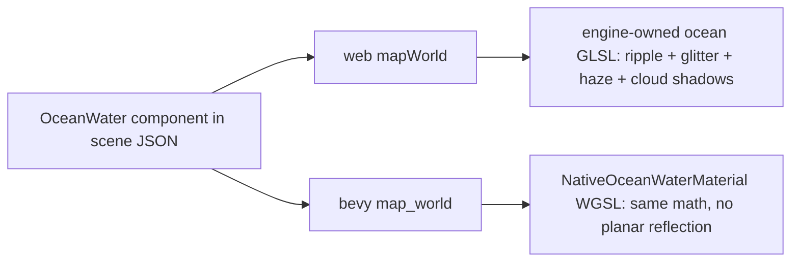

# PRD: Battle-of-Pacific Visual Parity — Mastery (Deep Track)

`Complexity: 9 → HIGH mode (multi-package, shaders, model pipeline, perf)`

**Executor profile:** the strong model. This PRD owns the hard problems AND
reviews/corrects everything the light track
(`visual-parity-pacific-groundwork-2026-07-23.md`) produced. Read
`SESSION-LEARNINGS.md` (repo root) first — it contains the staleness traps,
sign conventions, and the ocean-shader recipe this PRD builds on.

## 1. Context

**Problem:** Close the remaining gap to
`examples/battle-of-pacific/docs/reference/target-visual.png` (deep cobalt
ocean with glitter field and cloud shadows, vivid cumulus sky, convincing
aircraft materials, motion-blurred prop) at 60 FPS in the browser, with audio
working, and with the reusable pieces promoted into the engine rather than
left as example-local hacks.

**North-star loop (all visual phases):** `tn parity visual` against the
reference → inspect the score/artifact → change one thing → repeat. Do not
create a project-local screenshot/compare wrapper.

**Current state (post-groundwork assumptions):** parity history exists; easy
perf wins measured; sky swapped; audio either fixed or root-caused in
`artifacts/visual-parity/handoff.md`.

## 2. Solution

**Approach:**
- Phase 0 is a real review gate of the light track — trust nothing, re-verify.
- Then four deep workstreams as vertical slices: audio engine fix, 60 FPS,
  ocean shader ownership, aircraft model/prop quality — each ending in a
  measured parity/FPS delta.
- Finish by paying the engine debts this example exposed (native water
  parity, recipe contract, cookbook entries) so the next game inherits
  everything.

**Key decisions:**
- Fork the water shader into an engine-owned program (stop string-patching
  three's `Water` at runtime) while keeping the `OceanWater` component
  contract stable.
- Extend the Blender recipe contract (source-mode + primitive parts + scale
  tracks) rather than post-processing GLBs.
- Every phase re-runs `tn iterate` (must stay 7/7 green) and `pnpm run
  parity`; perf phases re-run `tn performance proof`.

**Architecture (ocean end-state):**

## 3. Execution Phases

#### Phase 0: Audit the light track — nothing advances until this passes

**Files:** none expected (fix-forward only where drift found).

**Implementation:**
- [ ] Re-run `tn parity visual`, `tn iterate`, `tn performance proof`; diff the
  results against `artifacts/visual-parity/handoff.md` claims.
- [ ] Verify the parity script's stale-build guard actually refuses a stale
  server (touch a content file, don't rebuild, expect exit 1).
- [ ] Review each groundwork file change for drift from its PRD (spawn
  `prd-work-reviewer` against the groundwork PRD for a final pass).
- [ ] Fix anything broken; record corrections in handoff.md.

**Checkpoint:** automated review PASS + all three commands reproduce claimed
numbers.

#### Phase 1: Audio — engine-grade fix

**Files (max 5):**
- `packages/runtime-web-three/src/audio.ts` — resume/unlock AudioContext on
  first user gesture (pointer or key), queue plays issued before unlock.
- `packages/runtime-web-three/src/devServer.ts` — add `.mp3` (and `.m4a`)
  content types if the light track didn't.
- `packages/runtime-web-three/src/audio.test.ts` — unlock + queued-play tests.
- `src/scripts/flight.ts` — remove any workaround the light track added.
- `overlay/flight-deck/src/App.tsx` — keep/remove sound hint accordingly.

**Implementation:**
- [ ] Root-cause from handoff.md; implement the real fix (most likely:
  AudioContext starts suspended; add a one-time gesture listener that resumes
  the context and flushes a pending-play queue).
- [ ] Confirm looping music/engine start after first gesture; guns/stall/splash
  cues fire; native target unaffected (`pnpm run playtest:native` green).

**Verification:** unit tests for the unlock queue; manual listen; playtest
console artifacts show no audio errors.

#### Phase 2: 60 FPS on web

**Files (max 5):**
- `packages/runtime-web-three/src/render.ts` — only a profile-proven renderer
  bottleneck fix.
- `packages/runtime-web-three/src/worldMapping/oceanWater.ts` — only a
  profile-proven water geometry/reflection fix.
- `content/runtime/default.runtime.json` — accepted authored performance choice.
- `artifacts/visual-parity/perf.md` — extend the measurement table.

**Implementation:**
- [ ] Instrument first with `tn performance trace` to find the actual top cost.
  Current source leaves Three.js at pixel ratio 1, so do not add
  `maxPixelRatio` unless a fresh trace and measured render-scale experiment
  establish that contract is needed.
- [ ] Treat runtime observation/audit overhead as a first-class suspect. Route
  a systemic fix through
  `session-learnings-remediation-2026-07-23/PRD-006-runtime-proof-cost-and-preview-freshness.md`.
- [ ] Iterate remaining hotspots until `tn performance proof --target web`
  reports ≥ 55 fps p95 at 1080p; record every A/B row.
- [ ] Guard: parity score must not drop more than 0.03 for any accepted perf
  change.

**Checkpoint:** perf proof artifact ≥ 55 fps + parity unchanged + iterate 7/7.

#### Phase 3: Ocean shader — own it, close the gap to ~90%

**Files (max 5):**
- `packages/runtime-web-three/src/worldMapping/oceanWater.ts` (new) — move
  ocean out of stylizedNature.ts; engine-owned ShaderMaterial that *forks*
  the jbouny program (vendored fragment with attribution comment) instead of
  runtime string patches; keeps: real-water F0, sun glitter outside fresnel,
  distance haze, cloud-shadow layer; adds: dual-scale chop (fine sparkle
  layer), whitecap flecks on crest threshold, tunable glitter width.
- `packages/runtime-web-three/src/worldMapping/oceanWater.test.ts` (new).
- `packages/runtime-web-three/src/worldMapping/stylizedNature.ts` — re-export
  shim only.
- `content/scenes/arena.scene.json` — final tuned component values.

**Implementation:**
- [ ] Vendor + fork the shader; delete the string-replace patching.
- [ ] Iterate with the parity loop against the reference's water region
  specifically (crop compare if `tn compare-images` supports regions;
  otherwise eyeball crops side by side and record subjective checklist:
  color depth ✓ glitter field ✓ cloud shadows ✓ chop density ✓ horizon haze ✓).
- [ ] Component contract unchanged (`color`, `sunColor`, `sunDirection`,
  `distortionScale`, `size`, `speed`) + new optional knobs documented.

**Checkpoint:** parity score at its best-yet; screenshot attached to
handoff.md; iterate 7/7.

#### Phase 4: Aircraft model, materials, prop blur — via the recipe contract

**Files (max 5):**
- `packages/authoring/src/operations/sharedA.ts` — allow `parts` +
  `materials` in source-mode recipes. Scale animation and a 16-clip budget
  already exist and need regression coverage, not reimplementation.
- `packages/cli/src/blender/runner.py` — build parts alongside imported
  source.
- `packages/authoring/src/operationRegistry.test.ts` — contract tests for the
  new allowances (positive + negative).
- `content/generators/aircraft.douglas-sbd3.recipe.json` — add: in-model
  translucent prop-blur disc part (emissive, alphaMode blend) and a
  `prop.blades-hide` scale track so blades vanish at high RPM; regenerate.
- `src/scripts/flight.ts` — drive blade-hide/disc via clip choice instead of
  the scene-entity disc; delete `aircraft.propdisc` workaround entities.

**Implementation:**
- [ ] Contract change first with tests (this is a reusable-pattern change:
  update the matching cookbook entry and run `pnpm verify:cookbook` per repo
  rule).
- [ ] Regenerate the GLB. Do not hand-clean the known assets-doc merge and
  `initialState` corruption as completion evidence; execute or depend on
  `session-learnings-remediation-2026-07-23/PRD-004-generator-regeneration-integrity.md`.
- [ ] Material pass on the aircraft: verify source GLB textures carry
  metalness/roughness; tune sun intensity/exposure so the livery reads like
  the reference (dark glossy navy with legible insignia).

**Checkpoint:** screenshot shows blur disc + no visible blades at full
throttle, blades resolve at idle; parity + iterate green; `tn generator run`
reproducible.

#### Phase 5: Engine debt paydown — native parity + wrappers + docs

**Files (max 5):**
- `runtime-bevy/crates/threenative_runtime/src/map_world.rs` (+ new
  `native_ocean_water_material.wgsl`) — `NativeOceanWaterMaterial` per the
  recipe in SESSION-LEARNINGS (analytic swell normals + fresnel + glitter,
  time-advanced; no reflections, documented boundary).
- `packages/runtime-web-three/src/mapWorld.ts` — mapper always wraps returned
  stylized objects in a Group (kills the vertical-plane trap class).
- `docs/status/capabilities/rendering.md` + `docs/STATUS.md` — OceanWater
  web/native status + boundaries.
- `docs/cookbook/ocean-water.md` (new) — component usage + tuning guide.

**Implementation:**
- [ ] WGSL material + Update-time uniform advance + desktop playtest
  screenshot evidence.
- [ ] Group-wrap in the mapper with a regression test.
- [ ] Cookbook + status rows; `pnpm verify:cookbook` + `pnpm check:docs`.

**Checkpoint:** `pnpm run playtest:native` green with visible native water;
docs checks pass.

#### Phase 6: Final parity report

- [ ] Best screenshot vs reference side-by-side committed under
  `artifacts/visual-parity/`; final similarity score, FPS number, audio
  confirmation, and the residual-gap list (honest: what still differs and
  why) written into `artifacts/visual-parity/final-report.md`.
- [ ] Full repo verification: `pnpm typecheck && pnpm test`,
  `pnpm verify:conformance`, cargo test suite, `tn game score/qa/release`
  still green with the scope-blocker set updated (audio blocker must be gone).

## 4. Checkpoint Protocol

HIGH complexity: after every phase, spawn `prd-work-reviewer` with this PRD
path + phase number (automated, always), AND pause for the user's manual
visual sign-off on Phases 3, 4, and 6 (screenshot pairs in the checkpoint
message). Continue only on PASS + user "continue".

## 5. Acceptance Criteria

- [ ] Parity similarity at its recorded maximum with side-by-side evidence;
      user signs off the final frame.
- [ ] ≥ 55 fps p95 at 1080p in `tn performance proof --target web`.
- [ ] Audio works end-to-end in the browser (post-gesture) with tests.
- [ ] Prop reads as a blur disc at power with no scene-entity workaround.
- [ ] OceanWater renders animated water on BOTH targets; boundaries
      documented; cookbook entry exists.
- [ ] Groundwork-track drift fully corrected (Phase 0 report).
- [ ] All repo gates green; no `dist/**` edits; learnings appended to
      `SESSION-LEARNINGS.md`.
