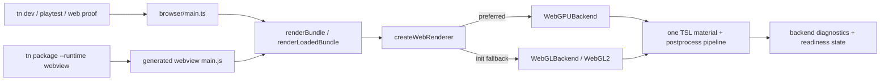

# PRD: WebGPU-First Three.js Runtime With WebGL2 Fallback

`Planning Mode: Principal Architect`
`Complexity: 7 -> HIGH mode`

Score basis: +3 (10+ files), +2 (new backend-neutral renderer and TSL
pipeline boundary), +2 (multi-package runtime, CLI packaging, and verification
changes).

## 1. Context

**Problem:** ThreeNative always constructs `THREE.WebGLRenderer`, so both the
`tn dev` preview and packaged `--runtime webview` distribution ignore WebGPU
even when the host supports it.

**Goal:** Make WebGPU the default Three.js backend in every game-runtime web
entry point, automatically use WebGL2 when WebGPU is unavailable or cannot be
initialized, and preserve the currently promoted rendering, capture, shader,
and diagnostics behavior in both modes.

**Non-goals:** Changing the Bevy renderer; exposing a backend choice in authored
IR; changing the editor's separate `EditorViewport3d` renderer; claiming WebGPU
support for browsers that cannot run Three.js's WebGPU or WebGL2 backend;
upgrading Three.js beyond the pinned `0.181.2`; adding a second renderer list or
duplicating dev/distribution selection logic.

### Files Analyzed

- `packages/runtime-web-three/src/render.ts` - directly constructs
  `THREE.WebGLRenderer`; owns rendering, post-processing, performance metrics,
  renderer configuration, and the public `IRenderResult`.
- `packages/runtime-web-three/src/renderTargets.ts` - types the renderer and
  render targets as WebGL-only.
- `packages/runtime-web-three/src/mapWorld.ts` - maps portable shader materials
  to unsupported `THREE.ShaderMaterial` GLSL.
- `packages/runtime-web-three/src/worldMapping/stylizedNature.ts` - implements
  ripple water with another WebGL-only `ShaderMaterial`.
- `packages/runtime-web-three/src/browser/main.ts` - shared dev-preview browser
  entry point and `window.__THREENATIVE_READY__` producer.
- `packages/runtime-web-three/src/devServer.ts` - Vite server used by `tn dev`,
  playtest, and screenshot proof commands.
- `packages/runtime-web-three/src/renderBundle.ts` - public entry point consumed
  by the webview distribution.
- `packages/cli/src/commands/dev.ts` - starts the shared web preview.
- `packages/cli/src/commands/package.ts` - generates and bundles the
  distribution/webview entry point with Vite.
- `packages/cli/src/commands/package.test.ts` - verifies packaged webview
  contents and readiness wiring.
- `tools/verify/src/webviewPackageGate.ts` and
  `tools/verify/src/webviewPackageGate.test.ts` - focused distribution gate.
- `docs/status/capabilities/rendering.md`,
  `docs/status/capabilities/native-parity.md`,
  `docs/status/capabilities/tooling-proof.md`, and `docs/STATUS.md` - owning
  capability/status surfaces.
- `packages/runtime-web-three/package.json` and `pnpm-lock.yaml` - pin Three.js
  `0.181.2`.

### Current Behavior

- `renderLoadedBundle()` synchronously constructs `THREE.WebGLRenderer`.
- `tn dev`, playtests, and web screenshot gates all reach that constructor
  through `startWebPreview()` and `browser/main.ts`.
- `tn package --runtime webview` builds a separate browser entry point, but it
  calls the same `renderBundle()` implementation and therefore the same
  WebGL-only constructor.
- `IRenderResult`, camera/render-target helpers, performance collection, and
  tests expose `THREE.WebGLRenderer` rather than an adapter-owned contract.
- The promoted post-processing stack uses WebGL `EffectComposer` passes
  (`GTAOPass`, `BokehPass`, `SSRPass`, `UnrealBloomPass`, and custom
  `ShaderPass`/`Pass` implementations). These cannot be passed to
  `WebGPURenderer`.
- Portable shader materials and stylized ripple water use `ShaderMaterial`,
  which Three.js `WebGPURenderer` does not support.

## 2. Solution

### Approach

- Introduce one adapter-private `createWebRenderer()` factory based on
  `WebGPURenderer` from `three/webgpu`. Call `await renderer.init()` before any
  render, clear, feature query, or render-target work.
- Rely on the pinned r181 renderer's owning fallback mechanism: it first
  initializes `WebGPUBackend`; when that backend is unavailable or rejects
  initialization, its `getFallback` callback initializes `WebGLBackend`
  (WebGL2). Do not perform a `navigator.gpu` precheck or maintain a parallel
  `WebGLRenderer` construction path.
- Detect the actual initialized backend through
  `renderer.backend.isWebGPUBackend` / `isWebGLBackend`, expose the stable value
  `"webgpu" | "webgl2"` in runtime diagnostics and readiness state, and emit a
  stable informational fallback diagnostic when WebGL2 was selected.
- Replace WebGL renderer types with a narrow adapter-owned `IWebRenderer`
  surface, keeping Three.js backend objects private. Preserve the existing
  renderer result only as this narrow interface; do not expose raw WebGPU,
  WebGL, device, context, or backend handles to authored scripts.
- Migrate WebGL-only portable materials and post-processing to Three.js TSL
  nodes. The same node graph must run on both `WebGPUBackend` and the common
  renderer's `WebGLBackend`, preventing two hand-maintained visual pipelines.
- Keep renderer selection inside `runtime-web-three`; both dev and packaged
  webview entry points must consume it without their own capability checks.

### Upstream Contract Anchors (Three.js 0.181.2)

- `three/webgpu` exports `WebGPURenderer`; its default constructor targets
  WebGPU and installs a WebGL2 fallback backend.
- r181 requires `await renderer.init()` before synchronous `render()`,
  `clear()`, or `hasFeature()` calls outside `setAnimationLoop()`.
- Backend identity is available after initialization through
  `renderer.backend.isWebGPUBackend` and
  `renderer.backend.isWebGLBackend`.
- Common-renderer post-processing uses `PostProcessing` plus TSL scene/pass
  nodes. Relevant pinned addons are `BloomNode`, `GTAONode`,
  `DepthOfFieldNode`, `SSRNode`, and `AfterImageNode` (used to retain the
  existing temporal-accumulation motion-blur semantics).
- `ShaderMaterial` and `RawShaderMaterial` are not supported by
  `WebGPURenderer`; ThreeNative's bounded shader IR must map to node materials.

References:

- [Three.js WebGPURenderer documentation](https://threejs.org/docs/pages/WebGPURenderer.html)
- [Three.js r180 to r181 migration notes](https://github.com/mrdoob/three.js/wiki/Migration-Guide)
- [Three.js WebGPU post-processing example](https://threejs.org/examples/webgpu_postprocessing.html)

### Architecture



### Backend Initialization Sequence

```mermaid
sequenceDiagram
  participant Entry as Dev or packaged entry
  participant Runtime as renderLoadedBundle
  participant Factory as createWebRenderer
  participant Three as WebGPURenderer
  Entry->>Runtime: renderBundle(bundle, container)
  Runtime->>Factory: createWebRenderer(options)
  Factory->>Three: new WebGPURenderer(parameters)
  Factory->>Three: await init()
  alt WebGPU initializes
    Three-->>Factory: WebGPUBackend
    Factory-->>Runtime: backend = webgpu
  else WebGPU unavailable/init rejected
    Three->>Three: getFallback() -> WebGLBackend
    Three-->>Factory: WebGL2 backend
    Factory-->>Runtime: backend = webgl2 + fallback diagnostic
  else neither backend initializes
    Factory-->>Runtime: TN_WEB_RENDERER_INIT_FAILED
    Runtime-->>Entry: reject startup; readiness ok = false
  end
```

### Key Decisions

- [x] Use one `WebGPURenderer` common-renderer family for both backends; never
      fall back to legacy `THREE.WebGLRenderer`.
- [x] Await initialization centrally, before scene pipeline creation.
- [x] Preserve authored antialias intent: map `none`/`fxaa`/`taa`/`smaa` to
      no hardware MSAA and `msaa2|4|8` to `antialias: true` plus matching
      `samples: 2|4|8`. Confirm unsupported sample counts during browser proof
      and use the common renderer's bounded supported value with an actionable
      diagnostic rather than failing silently.
- [x] Do not map `captureDrawingBuffer` to an unsupported WebGPU option.
      Browser screenshot/readback gates must prove capture after an explicit
      rendered frame in both backends; retain the option temporarily as a
      compatibility no-op and deprecate it separately only after call sites are
      migrated.
- [x] Migrate current effects to TSL before declaring WebGPU promoted. Do not
      select WebGL merely because a promoted effect or portable shader is used.
- [x] Treat WebGL2 selection as expected fallback, not a warning or readiness
      failure. Total initialization failure remains a stable error.
- [x] No IR/schema setting is added: backend choice is adapter-private and
      convention-based.

### Data Changes

No authored IR or bundle schema change. Runtime observation gains:

```ts
type WebRendererBackend = "webgpu" | "webgl2";

interface IWebRuntimeDiagnostics {
  renderer: {
    backend: WebRendererBackend;
    fallback: boolean;
  };
  // existing fields
}
```

`window.__THREENATIVE_READY__` gains the same stable `renderer` object so dev
tools and packaged-webview inspection can prove the selected backend without
accessing a raw renderer.

## 3. Integration Points

### How will this feature be reached?

- [x] Entry points identified:
  - dev: `tn dev`, `tn playtest`, and web proof commands ->
    `startWebPreview()` -> `browser/main.ts`;
  - distribution: `tn package --runtime webview` -> generated `src/main.js`;
  - library: public `renderBundle()` / `renderLoadedBundle()`.
- [x] Caller identified: `renderLoadedBundle()` is the sole renderer-factory
      caller for all game-runtime web entry points.
- [x] Registration/wiring needed: export backend-neutral result types from
      `runtime-web-three`; add readiness and package-gate inspection fields.

### Is this user-facing?

- [x] Yes. Games use WebGPU automatically where supported and continue through
      WebGL2 elsewhere. No settings UI is required because selection is the
      runtime default and not an authored choice. The existing debug/readiness
      surfaces show which backend was selected.

### Full User Flow

1. User runs `tn dev` or launches a packaged `--runtime webview` game.
2. The relevant browser entry calls the shared `renderBundle()` path.
3. The runtime initializes WebGPU through the common renderer, falling back to
   WebGL2 inside that same factory when necessary.
4. The game renders through the same TSL material/effect pipeline.
5. `window.__THREENATIVE_READY__.renderer` and runtime diagnostics report the
   selected backend; fallback remains `ok: true` when no error diagnostics
   exist.

## 4. Execution Phases

Each phase is a vertical slice and ends with an automated
`prd-work-reviewer` checkpoint. Because this is HIGH complexity, Phases 1, 3,
4, and 5 also require the listed manual/browser checkpoint before continuing.

### Phase 1: WebGPU-first baseline renderer

**Outcome:** A basic bundle opened through the shared runtime selects WebGPU
when initialization succeeds and WebGL2 when it does not.

**Files (max 5):**

- `packages/runtime-web-three/src/webRenderer.ts` - renderer factory, narrow
  contract, parameter mapping, backend detection, and stable diagnostics.
- `packages/runtime-web-three/src/webRenderer.test.ts` - dependency-injected
  initialization/fallback/parameter tests without requiring a GPU.
- `packages/runtime-web-three/src/render.ts` - await the factory and return the
  backend-neutral renderer/result metadata.
- `packages/runtime-web-three/src/render.test.ts` - update renderer mocks and
  test runtime diagnostic propagation.
- `packages/runtime-web-three/src/index.ts` - export stable observation types,
  not backend handles.

**Implementation:**

- [ ] Define `WebRendererBackend`, `IWebRenderer`, and
      `IWebRendererSelection`; include only methods/properties actually used by
      runtime code.
- [ ] Implement `createWebRenderer()` with `WebGPURenderer` from
      `three/webgpu`, `await init()`, backend identity validation, and error
      normalization.
- [ ] Emit `TN_WEB_RENDERER_WEBGL_FALLBACK` with severity `info`, path
      `runtime.renderer.backend`, and a suggestion to enable WebGPU only when
      WebGL2 is selected.
- [ ] Throw/report `TN_WEB_RENDERER_INIT_FAILED` when neither backend can
      initialize; include the upstream error without leaking device handles.
- [ ] Convert antialias values to `{ antialias, samples }`; retain capture as a
      documented no-op in the common renderer.
- [ ] Ensure no direct `new WebGLRenderer` remains in the game runtime.

**Tests Required:**

| Test File | Test Name | Assertion |
|---|---|---|
| `webRenderer.test.ts` | `should prefer WebGPU when the primary backend initializes` | selection is `webgpu`, fallback false, no fallback diagnostic |
| `webRenderer.test.ts` | `should report WebGL2 when WebGPU initialization falls back` | selection is `webgl2`, fallback true, stable info diagnostic |
| `webRenderer.test.ts` | `should fail startup when neither renderer backend initializes` | stable error preserves actionable cause |
| `webRenderer.test.ts` | `should map authored MSAA modes to common renderer samples` | none -> 0 and msaa2/4/8 -> 2/4/8 |
| `render.test.ts` | `should expose selected renderer backend in runtime diagnostics` | snapshot contains stable renderer observation |

**Verification Plan:**

```bash
pnpm --filter @threenative/runtime-web-three build
pnpm --filter @threenative/runtime-web-three test
pnpm --filter @threenative/runtime-web-three typecheck
```

**Manual checkpoint:** Open a minimal bundle once in a WebGPU-capable Chrome
and once with WebGPU disabled. The canvas renders in both; readiness reports
`webgpu` then `webgl2`.

### Phase 2: Backend-neutral camera, render-target, and metrics path

**Outcome:** Multi-camera views, render targets, resize, shadows, teardown,
and performance snapshots operate through either common-renderer backend.

**Files (max 5):**

- `packages/runtime-web-three/src/render.ts` - replace remaining WebGL-only
  signatures and normalize common-renderer metrics.
- `packages/runtime-web-three/src/renderTargets.ts` - use common `RenderTarget`
  and the narrow renderer contract.
- `packages/runtime-web-three/src/renderTargets.test.ts` - run camera-target
  behavior against backend-neutral mocks.
- `packages/runtime-web-three/src/render.test.ts` - cover multi-view, color,
  shadow, resize, performance, and disposal behavior.

**Implementation:**

- [ ] Replace public/private `THREE.WebGLRenderer` types with `IWebRenderer`.
- [ ] Use common renderer-supported `RenderTarget` objects; keep color/depth
      target ownership and texture bindings centralized in
      `renderTargets.ts`.
- [ ] Verify `setRenderTarget`, scissor/viewport, clear, shadow settings,
      color-space/tone-mapping, resize, and dispose behavior after `init()`.
- [ ] Read renderer metrics defensively from the common `renderer.info` shape;
      preserve the existing JSON schema and use zero only when the backend does
      not expose an existing metric.
- [ ] Add renderer backend to performance snapshots only if the owning
      performance schema is versioned in the same phase; otherwise keep it in
      runtime diagnostics to avoid an unversioned contract change.

**Tests Required:**

| Test File | Test Name | Assertion |
|---|---|---|
| `renderTargets.test.ts` | `should restore the common renderer target after offscreen camera passes` | prior target and auto-clear are restored |
| `render.test.ts` | `should render ordered camera views through a backend-neutral renderer` | existing viewport/order contract is unchanged |
| `render.test.ts` | `should collect available common renderer performance counters` | stable metrics are returned without WebGL programs dependency |
| `render.test.ts` | `should dispose renderer and render targets exactly once` | both backend modes have one teardown |

**Verification Plan:**

```bash
pnpm --filter @threenative/runtime-web-three test
pnpm verify:conformance
```

### Phase 3: WebGPU-compatible portable and built-in shader materials

**Outcome:** Portable shader fixtures and stylized ripple water render under
both backends without `ShaderMaterial` or raw GLSL.

**Files (max 5):**

- `packages/runtime-web-three/src/materials/portableShaderNodes.ts` - map the
  bounded shader IR expression tree to TSL nodes and node materials.
- `packages/runtime-web-three/src/materials/portableShaderNodes.test.ts` - node
  graph/binding/displacement tests.
- `packages/runtime-web-three/src/mapWorld.ts` - replace the current generated
  GLSL `ShaderMaterial` mapping with the TSL mapper.
- `packages/runtime-web-three/src/mapWorld.test.ts` - require node material,
  bindings, alpha/discard, texture, time, emissive, and displacement behavior.
- `packages/runtime-web-three/src/worldMapping/stylizedNature.ts` - express
  ripple water with TSL node material and update its time node in the existing
  sync path.

**Implementation:**

- [ ] Map shader IR literals, uniforms, texture samples, `normal`, `uv0`,
      `vertexColor`, `worldPosition`, `position`, and `elapsedTime` to TSL.
- [ ] Map base color/alpha/emissive outputs, alpha discard, and vertex-axis
      displacement to node-material slots; retain stable binding metadata in
      `userData` and existing conformance reports.
- [ ] Keep texture loading and authored texture controls in the existing
      centralized loader; pass resulting textures into TSL texture nodes.
- [ ] Replace ripple-water vertex displacement and fragment color/foam graph
      with TSL while preserving current component fields and visual intent.
- [ ] Delete runtime GLSL source helpers only after their last call site is
      migrated; do not remove IR GLSL/WGSL conformance code generation, which
      remains contract evidence.
- [ ] Add a drift test that fails if runtime code introduces `ShaderMaterial`
      or `RawShaderMaterial` outside an explicit diagnostic-only allowlist.

**Tests Required:**

| Test File | Test Name | Assertion |
|---|---|---|
| `portableShaderNodes.test.ts` | `should map every portable shader expression kind to TSL` | every validated expression has a node result |
| `portableShaderNodes.test.ts` | `should map elapsed time and displacement without raw shader source` | time uniform and position node are connected |
| `mapWorld.test.ts` | `should map portable shader materials to a WebGPU-compatible node material` | no `ShaderMaterial`; metadata and bindings preserved |
| existing stylized nature test | `should animate ripple water through a TSL time node` | update changes the time uniform/node value |

**Verification Plan:**

```bash
pnpm --filter @threenative/runtime-web-three test
pnpm verify:portable-shader-material
pnpm verify:focused verify:adapter-surface-drift
```

**Manual checkpoint:** Capture the portable-shader and stylized-nature fixtures
in both backend modes. Existing regions remain visible and animated; no
unsupported-material console errors appear.

### Phase 4: One TSL post-processing pipeline for both backends

**Outcome:** Promoted AO, depth of field, bloom, motion blur, SSR, and color
grading remain active without forcing WebGL.

**Files (max 5):**

- `packages/runtime-web-three/src/rendering/webPostProcessing.ts` - common TSL
  scene/MRT/effect graph, resize, render, and disposal ownership.
- `packages/runtime-web-three/src/rendering/webPostProcessing.test.ts` - graph
  selection, setting mapping, lifecycle, and fallback tests.
- `packages/runtime-web-three/src/render.ts` - replace `EffectComposer` and
  legacy pass classes with the new pipeline.
- `packages/runtime-web-three/src/render.test.ts` - update promoted effect and
  color-output assertions.

**Implementation:**

- [ ] Build one scene pass and only the G-buffer outputs required by enabled
      effects. Use pinned r181 TSL nodes: `bloom()`, `ao()`, `dof()`, and
      `ssr()`; combine them in deterministic authored order.
- [ ] Retain temporal-accumulation motion blur using `AfterImageNode` or an
      equivalent TSL history blend with the existing
      `clamp(shutterAngle * 0.3, 0, 0.25)` previous-frame weight. Do not switch
      to velocity motion blur without a separate parity PRD.
- [ ] Port the fitted ACES/exposure/contrast/saturation and one-time sRGB
      transfer into TSL; prevent renderer tone mapping plus output-node tone
      mapping from applying twice.
- [ ] Preserve current feature-setting helpers and conformance
      requested/applied reports; changing implementation is not permission to
      change portable semantics.
- [ ] Preserve single-backbuffer-view composer behavior. Multi-view and
      render-to-texture paths continue through direct camera passes until a
      separately proven per-view effect contract exists.
- [ ] Own all history/render targets/nodes in one disposable pipeline and reset
      size-dependent state on resize.
- [ ] Remove legacy `EffectComposer`, `GTAOPass`, `BokehPass`, `SSRPass`,
      `UnrealBloomPass`, `ShaderPass`, custom `Pass`, and fullscreen-quad use
      after parity proof passes.

**Tests Required:**

| Test File | Test Name | Assertion |
|---|---|---|
| `webPostProcessing.test.ts` | `should omit G-buffer outputs when no dependent effect is enabled` | baseline graph has no unused normal/depth/velocity targets |
| `webPostProcessing.test.ts` | `should compose promoted effects in deterministic order` | graph order matches AO -> SSR -> DOF -> motion -> bloom -> color output |
| `webPostProcessing.test.ts` | `should retain the calibrated temporal motion blend` | shutter mapping equals current bounded weight |
| `webPostProcessing.test.ts` | `should resize and dispose owned targets exactly once` | no retained history or G-buffer target |
| `render.test.ts` | `should apply color grading exactly once through the TSL output` | ACES/exposure/saturation contract matches existing calibration |

**Verification Plan:**

```bash
pnpm --filter @threenative/runtime-web-three test
pnpm verify:rendering-photoreal
pnpm verify:focused verify:feature-parity-visual-polish
pnpm verify:conformance
```

**Manual checkpoint:** Inspect WebGPU and forced-WebGL2 contact sheets for every
photoreal fixture. Effects are locally visible, readiness has no render error,
and existing calibrated regions remain within their owning thresholds. Record
performance snapshots for both backends; investigate material regressions or a
large frame-time increase before proceeding.

### Phase 5: Dev and packaged-webview end-to-end proof

**Outcome:** Both requested delivery paths prove the default and fallback
backend from their real browser entry points.

**Files (max 5):**

- `packages/runtime-web-three/src/browser/main.ts` - expose stable renderer
  readiness observation for dev/playtest/proof entry points.
- `packages/runtime-web-three/src/devServer.test.ts` - verify the preview serves
  the shared runtime entry and no backend-specific override.
- `packages/cli/src/commands/package.ts` - include renderer observation in the
  generated webview readiness payload; keep selection in the shared runtime.
- `packages/cli/src/commands/package.test.ts` - inspect built entry/package
  contract.
- `tools/verify/src/webviewPackageGate.ts` - launch/inspect the real packaged
  app in normal and WebGPU-disabled browser modes and record backend evidence.

**Implementation:**

- [ ] Extend the global readiness declaration and both readiness producers with
      `{ renderer: { backend, fallback } }` sourced from `IRenderResult`.
- [ ] Do not duplicate `navigator.gpu` checks or renderer constructors in
      `browser/main.ts` or the generated package entry.
- [ ] Extend the focused webview gate measurements with normal and fallback
      backend observations plus startup/readiness results.
- [ ] Run the packaged app in a WebGPU-capable Chromium configuration and in a
      second configuration with WebGPU disabled while preserving WebGL2.
- [ ] Assert both modes render a non-empty canvas, report no error diagnostics,
      expose the expected backend, and complete the same smoke interaction.
- [ ] Keep `webview.inspection.json` honest: the current launcher is still a
      local static server plus platform browser/webview handler, not an embedded
      Wry/Tauri claim.

**Tests Required:**

| Test File | Test Name | Assertion |
|---|---|---|
| `devServer.test.ts` | `should serve the WebGPU-first shared browser entry` | no separate WebGL constructor/override is served |
| `package.test.ts` | `package should expose renderer backend readiness from the shared runtime` | built package payload includes stable observation |
| `webviewPackageGate.test.ts` | `should require WebGPU and WebGL2 fallback startup evidence` | missing/mismatched backend observation fails the gate |
| browser E2E | `should prefer WebGPU in the dev preview when available` | ready, non-empty canvas, backend webgpu |
| browser E2E | `should render the packaged webview through WebGL2 when WebGPU is disabled` | ready, non-empty canvas, backend webgl2, fallback true |

**Verification Plan:**

```bash
pnpm --filter @threenative/runtime-web-three build
pnpm --filter @threenative/cli build
pnpm build:verify-tools
pnpm verify:webview-package
pnpm verify:smoke
```

**Manual checkpoint:** Run `tn dev` against a representative game and launch
the produced webview installer/package. Confirm controls, animation, UI,
capture, and selected-backend readiness in both browser configurations.

### Phase 6: Capability documentation and release enrollment

**Outcome:** Status claims and release gates describe and enforce the promoted
WebGPU-first behavior.

**Files (max 5):**

- `docs/status/capabilities/rendering.md` - backend policy, TSL migration,
  diagnostics, limitations, and proof commands.
- `docs/status/capabilities/native-parity.md` - clarify that webview packaging
  uses the WebGPU-first Three.js adapter with WebGL2 fallback.
- `docs/status/capabilities/tooling-proof.md` - document dual-backend webview
  gate evidence.
- `docs/STATUS.md` - update the one-line rendering/tooling index entries.
- `tools/verify/src/release.test.ts` - assert the descriptor-owned webview gate
  remains enrolled in release verification; update the owning descriptor only
  if enrollment is currently missing.

**Implementation:**

- [ ] Document the exact default/fallback semantics and stable diagnostic
      codes; avoid claiming all browsers support either backend.
- [ ] Link the focused webview and rendering evidence from the owning status
      pages.
- [ ] Confirm `verify:webview-package` is derived from the owning gate
      descriptor in release verification. Do not add a second hand-maintained
      release list.
- [ ] Update `docs/bevy-feature-parity.md` only if evidence links or parity
      claims change; a web-only backend default does not by itself alter Bevy
      feature parity.

**Tests Required:**

| Test File | Test Name | Assertion |
|---|---|---|
| `tools/verify/src/release.test.ts` | `should enroll the dual-backend webview gate in release verification` | descriptor-derived release command includes the gate |
| docs gate | existing docs validation | all status links and required index entries are valid |

**Verification Plan:**

```bash
pnpm check:docs
pnpm verify:webview-package
pnpm verify:release
```

## 5. Checkpoint Protocol

After each phase, spawn `prd-work-reviewer` with this PRD path and the phase
number. Continue only on `PASS`. For Phases 1, 3, 4, and 5, automated review is
followed by the manual/browser checkpoint specified in that phase.

Checkpoint prompt:

```text
Review implementation checkpoint.
PRD path: docs/PRDs/webgpu-default-webgl-fallback-2026-07-09.md
Phase: <N>
Compare the implementation and tests against the phase requirements, run the
narrow verification commands, inspect unrelated work preservation, and report
PASS, NEEDS CORRECTION, or BLOCKED.
```

## 6. Verification Strategy

### Required Evidence

- Unit proof for renderer parameter mapping, backend observation, diagnostics,
  narrow contract behavior, TSL shader mapping, and post-processing graph.
- Integration proof through `renderLoadedBundle()` for both injected backend
  outcomes.
- Real-browser dev preview proof for preferred WebGPU and forced WebGL2.
- Real packaged-webview proof for preferred WebGPU and forced WebGL2 using the
  exact built app, not an isolated renderer demo.
- Existing portable shader, photoreal rendering, conformance, visual polish,
  smoke, and release gates remain green.
- Evidence includes backend identity, fallback flag, readiness, diagnostic
  codes, canvas dimensions/non-empty capture, and startup duration.

### Final Verification Commands

Run narrow checks after each phase, then before completion:

```bash
pnpm build
pnpm typecheck
pnpm lint
pnpm test
pnpm verify:conformance
pnpm verify:portable-shader-material
pnpm verify:rendering-photoreal
pnpm verify:focused verify:feature-parity-visual-polish
pnpm verify:webview-package
pnpm verify:smoke
pnpm check:docs
pnpm verify:release
```

If a broad command is infeasible, record the exact reason and all narrower
commands run; do not claim completion without both real backend browser proofs.

## 7. Acceptance Criteria

- [ ] `tn dev`, playtests, and web proof commands prefer WebGPU without a flag
      when WebGPU initialization succeeds.
- [ ] `tn package --runtime webview` uses the same shared selection and prefers
      WebGPU in its built distribution.
- [ ] Both paths automatically render through WebGL2 when WebGPU is unavailable
      or its backend initialization rejects.
- [ ] No game-runtime `new THREE.WebGLRenderer` path or duplicated backend
      capability check remains.
- [ ] The renderer is initialized before render, clear, target, feature, or
      capture operations.
- [ ] Runtime diagnostics and `window.__THREENATIVE_READY__` truthfully expose
      `webgpu` or `webgl2`; expected fallback does not make readiness fail.
- [ ] Portable shader materials and built-in ripple water contain no runtime
      `ShaderMaterial`/raw GLSL dependency and render in both backends.
- [ ] Promoted AO, DOF, bloom, temporal motion blur, SSR, and calibrated color
      output run through one TSL pipeline in both backends.
- [ ] Multi-camera, render-target, shadow, resize, screenshot, performance, and
      teardown behavior remains covered.
- [ ] Dev and packaged browser evidence proves a non-empty rendered frame in
      preferred and fallback modes.
- [ ] All automated phase reviews pass; required manual/browser checkpoints are
      recorded.
- [ ] Relevant capability docs and `docs/STATUS.md` one-line entries are
      updated, and the focused webview proof remains descriptor-owned in release
      verification.
- [ ] On completion, move this PRD to `docs/PRDs/done/` per repository policy.

## Risks And Mitigations

| Risk | Impact | Mitigation |
|---|---|---|
| Legacy `EffectComposer` passes are WebGL-only | High: promoted effects fail or silently force WebGL | Complete Phase 4 TSL migration before promotion; dual-backend photoreal proof is mandatory |
| `ShaderMaterial` is unsupported | High: portable shader and ripple-water scenes fail | Phase 3 maps the bounded IR and built-in water to node materials; drift test prevents regression |
| Browser reports `navigator.gpu` but adapter/device initialization fails | High: startup failure despite apparent support | Let `WebGPURenderer.init()` own fallback; never gate only on `navigator.gpu` |
| Headless CI lacks a stable WebGPU device | Medium: preferred-path proof becomes flaky | Use the repository's pinned Chromium configuration with explicit WebGPU/ANGLE flags; record adapter details and fail with actionable infrastructure diagnostics rather than silently skipping |
| WebGPU MSAA support differs by adapter | Medium: init or visual differences | Map authored sample count explicitly, validate in real browsers, and emit a stable bounded-fallback diagnostic when the adapter cannot honor it |
| Capture behavior differs without `preserveDrawingBuffer` | High: visual gates capture blank frames | Render explicitly before capture and prove non-empty images in both backends before treating the old option as a no-op |
| TSL color output double-applies tone mapping or sRGB | High: broad visual parity regression | Own output transform in one node graph and retain calibrated region/contact-sheet gates |
| Common-renderer performance counters differ from WebGLRenderer | Medium: proof schemas regress | Normalize only existing counters, preserve schema, and expose backend identity separately |
| WebGPU is slower for high object counts on some adapters | Medium: user-visible regression | Record paired performance snapshots on representative fixtures; preserve WebGL2 fallback for unavailable/failed initialization, and open a separate policy PRD if runtime performance-based selection is desired |
| Mixing imports from `three` and `three/webgpu` causes type/runtime identity drift | Medium: subtle material/object failures | Centralize common-renderer-only imports, verify package export identity, and use the adapter contract instead of spreading renderer types |
| Packaged launcher is not an embedded webview | Low: misleading distribution claim | Preserve current inspection wording and prove the actual localhost/browser-handler artifact only |

## Explicit Deferred Work

- User-selectable backend overrides or authored runtime renderer preferences.
- Performance-based automatic fallback after successful WebGPU initialization.
- Recovery from GPU device loss after startup.
- Migrating the editor-only `EditorViewport3d` to WebGPU.
- Replacing the current platform browser/webview handler with an embedded
  Wry/Tauri host.
- New WebGPU-only materials, compute passes, storage buffers, or renderer/device
  handles in public authoring APIs.
