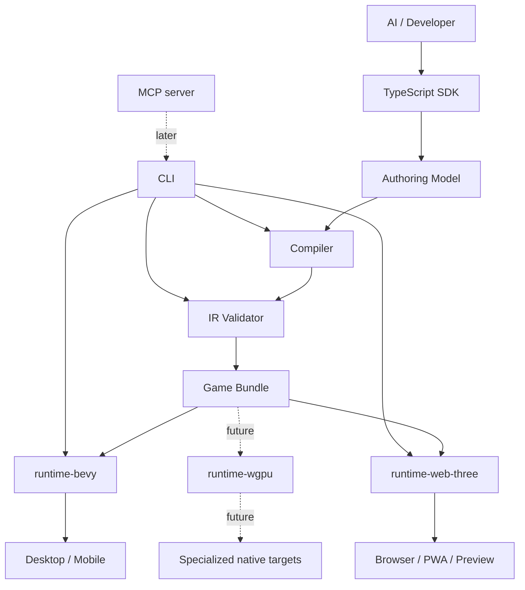
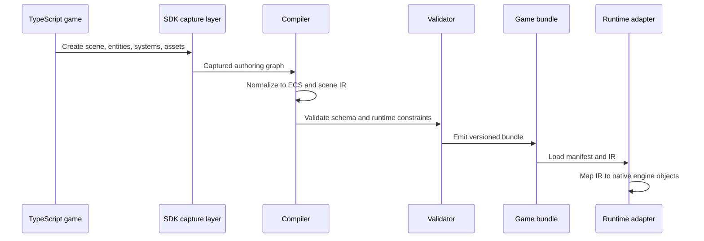
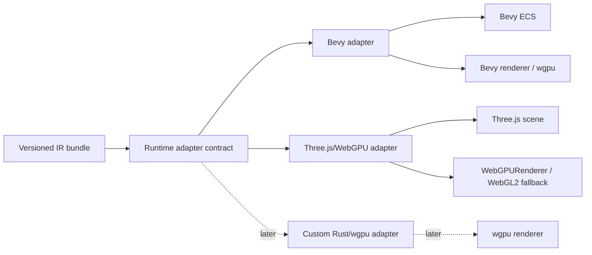

# Architecture

This project is a TypeScript game SDK with a Three.js-like authoring surface and
native runtimes behind it. The core architectural bet is that the public API
should stay familiar to TypeScript developers and AI code generators, while the
runtime execution model should be explicit, validated, and portable.

The SDK does not execute arbitrary Three.js code in a native engine. It provides
a compatible subset and adjacent ECS authoring API that both compile to a stable
intermediate representation.

## Goals

- Let users author simple 3D games in TypeScript with a familiar Three.js-style
  object model.
- Compile authoring code into typed world, systems, UI, material, asset,
  animation, input, and target-profile IR.
- Run the same IR through multiple runtime adapters:
  - Native Bevy first.
  - Web Three.js/WebGPU for preview and browser distribution.
  - Future custom Rust/wgpu only if Bevy blocks product needs.
- Keep native runtime internals invisible to SDK users.
- Make validation strict enough that AI-generated code fails early with useful
  diagnostics.

## Non-Goals

- Full Three.js compatibility.
- Arbitrary JavaScript-to-Rust compilation.
- Exposing Bevy APIs in the public TypeScript SDK.
- Using WebViews as the native performance strategy.
- Building a visual editor before the SDK, compiler, CLI, and runtimes are
  useful.
- Supporting arbitrary browser APIs, DOM integration, WebGL internals, renderer
  monkey-patching, or unrestricted shader hacks in the first product phases.
- Replacing Bevy with a custom renderer before the IR and product loop are
  proven.

## System Overview



The IR is the contract. The TypeScript SDK is allowed to evolve internally, and
each runtime adapter can map data into its native engine idioms, but the bundle
format must remain explicit, versioned, and testable.

## Authoring Model

The SDK supports multiple authoring styles that produce the same portable IR.

### Three.js-Like Scene API

This is optimized for approachability and AI generation:

```ts
const scene = new Scene();

const player = new Mesh(
  new BoxGeometry(1, 2, 1),
  new MeshStandardMaterial({ color: "red" })
);

player.position.set(0, 1, 0);
scene.add(player);
```

The SDK records object construction, hierarchy, transforms, materials, geometry,
and assets into a compile-time scene graph. It should feel familiar, but only
documented SDK behavior is portable.

### ECS-First API

This is optimized for game logic and runtime clarity:

```ts
world.spawn(
  Transform.position(0, 1, 0),
  MeshRenderer.box({ size: [1, 2, 1] }),
  Material.standard({ color: "red" }),
  PlayerController({ speed: 5 })
);
```

The ECS API should expose the same component vocabulary used by the IR. The
scene API can be treated as a friendly builder over the ECS representation.

### React-Style UI API

This is optimized for HUDs, menus, touch controls, and AI-friendly UI authoring:

```tsx
export function HUD() {
  return (
    <Stack id="hud.root" anchor="top-left" padding={16}>
      <Text text={bind.template`HP ${bind.resource("PlayerStats.health")}`} />
      <Bar value={bind.resource("PlayerStats.healthPercent")} />
    </Stack>
  );
}
```

React is the authoring model. React DOM is not the portable runtime contract.
The compiler emits `ui.ir.json`; web can render it with React DOM, while native
adapters recreate it with Bevy UI or another native UI renderer.

## Core Pipeline



The compiler should prefer structured SDK APIs over source-code string scraping.
Early versions can run game setup code in a controlled Node process to capture
the authoring graph, but emitted IR must not depend on arbitrary runtime side
effects.

## Game Bundle

Initial bundles should be directory-based and JSON-first for debuggability:

```txt
game.bundle/
  manifest.json
  world.ir.json
  ui.ir.json
  materials.ir.json
  assets.manifest.json
  animations.ir.json
  input.ir.json
  systems.ir.json
  scripts.bundle.js
  target.profile.json
```

Binary encodings can come later after the schema is stable and profiling shows
that JSON load time matters.

Every bundle manifest should include:

- `schema`: bundle schema identifier.
- `version`: bundle schema version.
- `sdkVersion`: SDK version that emitted the bundle.
- `requiredCapabilities`: features a runtime must support.
- `assets`: stable asset IDs, source paths, content hashes, roles, and
  preprocessing metadata.
- `entrypoints`: setup and lifecycle hooks available to runtimes.
- `targetProfiles`: validation settings for web, desktop, Android, and iOS.

## IR Domains

The V1 bundle should use one `world.ir.json` file for entity, component,
resource, prefab, hierarchy, tag, and scene data. Related domains can live in
separate files when they have different loading or preprocessing needs:

- World IR: entities, components, tags, resources, events, prefabs, hierarchy,
  transforms, cameras, lights, visibility, and root objects.
- Systems IR: system exports, declared queries, read/write sets, stage
  placement, ordering constraints, and command permissions.
- UI IR: retained UI tree, styles, layout primitives, ECS bindings, input
  actions, emitted events, and safe-area behavior.
- Geometry IR: primitive geometry parameters and references to generated or
  imported meshes.
- Material IR: portable PBR material parameters, texture slots, alpha behavior,
  and feature flags.
- Asset Manifest: glTF, textures, audio, generated assets, hashes, import
  settings, and runtime-ready variants.
- Animation IR: clips, tracks, state machines, bindings, and playback defaults.
- Input IR: logical actions, axes, touch controls, keyboard mappings, and
  gamepad mappings.
- Physics IR: colliders, rigid bodies, triggers, layers, and broad runtime
  expectations.
- Script IR: lifecycle hooks, system entrypoints, permissions, and required host
  APIs.

Each domain should have an explicit schema, validator, fixture set, and runtime
conformance tests.

## Bevy-Compatible ECS Shape

The ECS model should be designed so it can map directly into Bevy without making
Bevy part of the public contract.

Bevy's `World` stores entities, components, resources, and metadata. Each Bevy
entity has a set of unique component types, and systems normally access those
components through typed queries. The SDK should mirror that shape at the
portable level:

- An SDK entity is a stable logical object with a string ID.
- A Bevy `Entity` is a runtime handle created by `runtime-bevy`.
- The IR must never assume that Bevy entity IDs are stable across launches,
  reloads, targets, or serialized bundles.
- Every spawned Bevy entity should receive a `ThreeNativeId`-style component
  containing the SDK entity ID for diagnostics, hot reload, save/load, and script
  lookup.
- Components should be unique by component type per entity unless the IR
  explicitly models a collection component.
- Global game state should be represented as resources, not singleton entities,
  when it naturally behaves like Bevy `Resource` data.

This keeps the model compatible with Bevy while preserving flexibility for the
web adapter and a future custom runtime.

### Hierarchy and Transforms

Three.js authors expect `Object3D.add(child)` to create a single-parent
hierarchy. Bevy represents this through entity relationships plus local
`Transform`; `GlobalTransform` is computed by Bevy's transform propagation.

The IR should therefore store:

- stable entity IDs
- optional parent entity ID
- local transform only: position, rotation, scale
- visibility/layer metadata

The IR should not store Bevy `GlobalTransform` as authored state. Runtime
adapters may compute or cache global transforms, but parent-child local
transforms are the source of truth.

### Structural Changes

Bevy applies structural changes such as spawn, despawn, and component insertion
through command queues in normal systems. The portable script host should expose
the same discipline:

- scripts may request `spawn`, `despawn`, `addComponent`, and `removeComponent`
  through a command buffer
- commands are applied at defined schedule boundaries
- query iteration must not be invalidated by immediate structural mutation
- validators should reject systems that mutate components they did not declare

This is stricter than normal JavaScript object mutation, but it aligns with how
native ECS runtimes remain predictable and parallelizable.

### Scheduling

The first scheduling model should be small and explicit:

- `startup`: runs once after bundle load and asset registration
- `fixedUpdate`: deterministic gameplay simulation, optional fixed timestep
- `update`: frame-rate gameplay and input response
- `postUpdate`: follow cameras, derived transforms, cleanup, and late commands
- `renderExtract`: adapter-owned; user scripts cannot run here

The Bevy adapter can map these into Bevy schedules and system sets. Other
adapters only need to preserve the same observable order.

## Module Boundaries

Recommended repository boundaries:

```txt
packages/
  sdk/
    scene/
    ecs/
    materials/
    geometry/
    animation/
    input/
    physics/
  compiler/
    ir/
    extract/
    validate/
    emit/
  cli/
  mcp-server/
  runtime-web-three/
  runtime-bevy/
```

### SDK

Owns the public TypeScript API. It should not import runtime adapter packages.
Its job is to build a typed authoring graph and expose ergonomic APIs.

### Compiler

Owns graph normalization, IR construction, validation orchestration, and bundle
emission. It should be deterministic: the same source, SDK version, assets, and
target profile should produce the same bundle.

### Validator

Owns schema validation and product constraints. It should catch unsupported
features before a runtime starts. Validation errors are part of the developer
experience and must be specific enough for AI repair loops.

### CLI

Owns user-facing commands:

```bash
tn create my-game
tn dev --target web
tn dev --target desktop
tn build --target android
tn validate
tn profile --target android
tn doctor
```

The CLI should be the backbone used by humans, CI, and the future MCP server.

### Runtime Adapters

Own loading a validated bundle and mapping IR into a concrete runtime. Adapters
must not define new public SDK concepts. If a runtime needs a new concept, add it
to the IR intentionally.

## Runtime Targets



The first native implementation should be Bevy because it provides ECS,
rendering, assets, animation, audio, and native platform integration. The custom
Rust/wgpu path should remain an escape hatch, not the starting point.

The web runtime should use real Three.js and WebGPURenderer where available. It
is the preview and browser distribution target, not the definition of native
runtime behavior.

## Scripting Model

TypeScript is the primary authoring and gameplay scripting language. Early
runtime scripting should be constrained through explicit lifecycle hooks and host
APIs:

```ts
export function updatePlayer(ctx: GameContext) {
  const player = ctx.query.one(PlayerController, Transform);
  player.transform.position.x +=
    ctx.input.axis("moveX") * player.controller.speed * ctx.dt;
}
```

The compiler should know which systems exist, which components they query, and
which runtime capabilities they require. Performance-critical systems can later
move to Rust, but that should not be required for early games.

TypeScript systems do not become Rust systems in V1. Native runtimes host the
compiled JavaScript, expose only declared ECS data, and apply returned component
patches, events, and command buffers through Rust-owned runtime code. Rust/Bevy
remains the execution authority.

Lua or Luau may be useful later for mods or sandboxed user-generated behavior.
They are not the primary v1 scripting language.

## UI Model

Game UI is part of the portable bundle, but it is separate from gameplay
scripting:

```txt
React-style TSX
  -> UI capture
  -> ui.ir.json
  -> web React DOM renderer
  -> native Bevy/custom UI renderer
```

UI reads ECS state through declared bindings and emits events or input actions.
It should not directly mutate Bevy, Three.js, DOM, or native platform state.

## Architecture Principles

- Stable IR over runtime leakage: user code targets SDK concepts, not Bevy,
  Three.js internals, or wgpu directly.
- Small supported subset over broad compatibility claims: unsupported behavior
  should fail validation.
- Explicit schemas over prompt discipline: AI friendliness comes from clear APIs,
  docs, examples, and validators.
- Deterministic builds over runtime discovery: bundle output should be repeatable
  and inspectable.
- Runtime parity where it matters: gameplay semantics, transforms, assets,
  materials, input, and animation should behave consistently across adapters.
- Adapter isolation over shared lowest-common-denominator code: each runtime can
  use its engine idioms behind a shared contract.
- Mobile constraints from the start: asset sizes, draw calls, texture formats,
  input, lifecycle, and thermal behavior should shape validation rules early.
- JSON first, binary later: optimize representation after the model is proven.

## Early-Phase Decisions

- Product name in docs and APIs can stay provisional. Use neutral package names
  until naming is decided.
- The first MVP is a mobile-friendly third-person arena demo, not a general
  editor or compatibility showcase.
- Phase 0 proves one cube, one camera, one light from TypeScript to native Bevy.
- Phase 1 adds the small Three.js-like scene subset and matching web runtime.
- Phase 2 adds ECS gameplay, input, time, queries, prefabs, and systems.
- Phase 3 adds glTF, textures, and animation.
- Phase 4 focuses on Android and iOS build pipelines, touch input, safe areas,
  lifecycle, resolution scaling, and profiling.
- MCP comes after the SDK, CLI, validator, and at least one runtime path are
  real.

## Compatibility Policy

Compatibility should be stated in terms of this SDK, not upstream Three.js.

Supported early:

- `Scene`
- `Object3D`
- `Mesh`
- camera types needed by examples
- basic light types
- transforms
- box, sphere, and plane geometry
- glTF model references
- PBR standard materials
- textures
- animation clips
- input
- simple physics metadata
- prefabs and systems

Restricted early:

- raw WebGL or WebGPU access from user code
- custom renderer hooks
- arbitrary postprocessing graphs
- arbitrary browser APIs
- DOM integration
- undocumented Three.js internals
- monkey-patching SDK or runtime objects
- shader code without a portable material or shader IR

## Open Design Areas

These should become explicit design docs before implementation hardens:

- Coordinate conventions and unit scale.
- Rotation representation in public API and IR.
- Color spaces and texture color management.
- Asset pipeline source-of-truth and cache layout.
- Runtime script execution model in Bevy native builds.
- System scheduling, determinism, and fixed-step simulation.
- Physics engine choice and portability constraints.
- Material feature levels for mobile, web, and native.
- Error code taxonomy for validators and AI repair loops.
