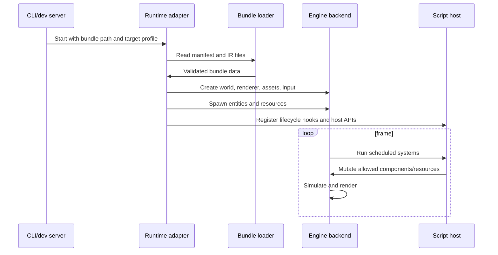
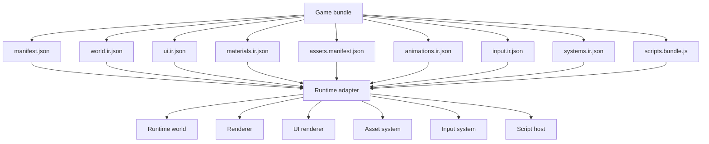

# Runtime Adapters

Runtime adapters load validated game bundles and map portable IR into a concrete
engine. They are intentionally internal. SDK users write TypeScript against the
public SDK, not Bevy, Three.js internals, or future wgpu renderer APIs.

This document defines adapter responsibilities, shared contracts, and early
decisions for the first three target paths:

- Bevy native runtime.
- Three.js/WebGPU web runtime.
- Future custom Rust/wgpu runtime.

## Adapter Contract

Every runtime adapter must implement the same high-level lifecycle:



Adapters are responsible for:

- Loading a bundle manifest and all referenced IR files.
- Verifying manifest `version`, `requiredCapabilities`, and target profile support.
- Resolving assets through the asset manifest.
- Creating runtime entities, components, materials, textures, animations, input
  devices, cameras, lights, UI nodes, and physics objects.
- Running TypeScript systems through the approved script interface. Web runs
  JavaScript output directly; native Bevy runs the same JavaScript bundle in
  embedded QuickJS once the V4 host is enabled.
- Reporting diagnostics with stable error codes where possible.
- Exposing profiling data to the CLI after V2; profiling reports are not a V2
  release gate.
- Supporting hot reload during development where practical.

Adapters are not responsible for:

- Accepting invalid IR.
- Guessing how to implement undocumented SDK features.
- Exposing backend-native APIs to user TypeScript.
- Defining public SDK concepts.
- Performing broad asset authoring work that belongs in the compiler or asset
  preprocessor.

## Shared Runtime Data Flow



The adapter should treat the bundle as immutable input. Runtime state can evolve
during gameplay, but dev hot reload should always reconcile from a new validated
bundle.

## Capability Negotiation

The compiler and validator should emit explicit capability requirements:

```json
{
  "schema": "threenative.bundle",
  "version": "0.1.0",
  "requiredCapabilities": {
    "rendering": ["pbr.standard", "shadow.basic"],
    "assets": ["gltf.static", "texture.png"],
    "input": ["keyboard", "touch.virtualStick"],
    "scripting": ["typescript.systems"],
    "physics": ["collider.aabb"]
  }
}
```

For V1, `requiredCapabilities` lives in `manifest.json` so adapters can reject
unsupported bundles before loading domain-specific files. Adapters must fail
fast if a required capability is unsupported. They may expose optional
capabilities, but user code should only rely on capabilities that are declared
and validated.

## Bevy Native Adapter

The Bevy adapter is the first native runtime and the initial performance target.
It should map IR into Bevy ECS and Bevy's renderer without leaking Bevy concepts
into the SDK.

### Responsibilities

- Load bundle files from disk or packaged app resources.
- Map IR entities to Bevy entities.
- Map Transform IR to Bevy transform components.
- Map Mesh and Geometry IR to Bevy mesh handles.
- Map Material IR to Bevy PBR materials.
- Map Camera and Light IR to Bevy camera and light components.
- Load glTF, textures, and animation assets through Bevy's asset system where
  possible.
- Register runtime components for SDK components.
- Run scheduled game systems and TypeScript lifecycle hooks through the native
  script host once V4 enables embedded QuickJS execution.
- Recreate portable `ui.ir.json` nodes with a native UI renderer.
- Handle desktop platform lifecycle events. Mobile packaging and lifecycle
  coverage are V3, while V2 may still use touch-ready input/profile data.
- Provide profiling data after V2 for frame time, asset load time, entity counts,
  draw calls where available, and memory estimates.

### Bevy Boundary

Bevy is an implementation detail. The adapter package can use Bevy APIs freely,
but these rules should hold:

- No public TypeScript API should require Bevy terminology.
- No IR schema should contain Bevy-specific type names unless under an explicit
  adapter-private extension namespace.
- Bevy version churn is handled inside `runtime-bevy`, not in user projects.
- Bevy versions should be pinned, with runtime conformance tests before
  upgrades.

### Entity and Component Mapping

The Bevy adapter should treat SDK entity IDs as the stable identity layer and
Bevy `Entity` values as process-local handles.

Required mapping behavior:

- Maintain an adapter-owned map from SDK entity ID to Bevy `Entity`.
- Insert a stable ID component on each spawned Bevy entity for diagnostics,
  script lookup, hot reload, and save/load.
- Never serialize Bevy `Entity` handles into portable IR.
- Resolve entity references in components through SDK IDs during load, then map
  them to Bevy handles after all entities are spawned or reserved.
- Keep adapter-private components under a runtime namespace so they do not
  become public SDK API by accident.

Portable components should map to Bevy components as directly as possible:

| Portable component | Bevy mapping |
| --- | --- |
| `Transform` | local `Transform`; Bevy computes global transform |
| `Parent` / hierarchy | Bevy entity relationship/child mapping |
| `MeshRenderer` | mesh handle plus material handle components |
| `Camera` | camera and projection components |
| `Light` | point, directional, or spot light components |
| `Name` / debug label | Bevy name/debug metadata plus stable SDK ID |
| `Visible` / layers | visibility and render layer components where available |

The adapter may decompose one portable component into several Bevy components,
or combine several portable fields into one Bevy component, but the conversion
must be deterministic and covered by conformance fixtures.

### Schedule Mapping

The adapter should map portable schedules into Bevy schedules/system sets with a
small explicit contract:

- `startup`: create resources, spawn initial entities, bind assets.
- `fixedUpdate`: run fixed-timestep gameplay systems.
- `update`: run frame input and normal gameplay systems.
- `postUpdate`: apply late commands, camera follow, cleanup, and derived state.
- adapter-owned render extraction/render systems remain internal.

Script systems should declare their read/write component access in the IR. The
Bevy adapter can use that metadata for validation, diagnostics, and later
parallel scheduling. Structural script commands should be buffered and applied
at schedule boundaries instead of mutating the world during query iteration.
Component patches are field-merge operations. A script patch such as
`entity.patch(Transform, { position })` must preserve the entity's existing
`rotation` and `scale`; full replacement is reserved for explicit component
`set` operations. Follow/chase cameras should be authored with the portable
Camera `follow` metadata and applied during `postUpdate`, instead of mutating
runtime camera rotations directly from gameplay scripts.

### Scene Loading Strategy

Bevy has scene and dynamic scene facilities, but the first adapter should not
depend on Bevy's scene serialization format as the portable bundle format. The
runtime should load the project IR itself and spawn Bevy entities/components
from that data.

Use Bevy scene features opportunistically only inside the adapter, for example
for fixtures or development tools. The portable format remains the SDK IR.

### Native Platform Scope

Early native scope:

- Desktop development window.
- Keyboard, pointer, and touch-ready logical input.
- Resolution scaling and FPS caps.

Out of early scope:

- Console targets.
- Native multiplayer stack.
- Advanced renderer customization.
- Full editor integration.
- Android and iOS packaging; mobile target profiles and packaging move to V3
  after desktop and web runtimes are stable.

### TypeScript System Execution

The scripting implementation is a V4 design gate. The adapter should start with
a narrow host API:

- `init(ctx)`
- `update(ctx)`
- named systems declared by `systems.ir.json`
- read/write access only to declared components and resources
- input, time, asset, and scene commands through explicit context objects

The runtime must avoid giving scripts direct access to Bevy world internals. V2
may limit native execution to setup-generated IR, static bundle loading, simple
built-in systems, and a stable unsupported-host diagnostic. V4 should add
native script hosting by loading `scripts.bundle.js` into QuickJS, calling JS
system exports, validating returned patches/events/commands against
`systems.ir.json`, and applying mutations at schedule boundaries.

### Native UI Execution

Post-V1, the Bevy adapter should treat `ui.ir.json` as a retained UI tree:

- Map portable UI nodes to Bevy UI nodes or another native UI renderer.
- Resolve bindings from ECS resources/components into UI text, visibility,
  progress values, and enabled states.
- Emit UI events, commands, or input actions back into the ECS event/input
  systems.
- Respect safe-area metadata and target profile constraints.
- Keep React and browser DOM concepts out of the native runtime.

The first native UI implementation after V1 should favor simple HUDs, touch
controls, and pause/menu screens over full CSS parity.

## Three.js/WebGPU Web Adapter

The web adapter is the browser preview and distribution path. It should use
Three.js directly and prefer WebGPURenderer where available, with fallback
behavior controlled by the adapter and target profile.

### Responsibilities

- Load bundles over local dev server or static hosting.
- Map Scene and Object3D IR to a Three.js scene graph.
- Map Mesh, Geometry, Material, Camera, and Light IR to Three.js objects.
- Load glTF and textures using Three.js loaders.
- Run TypeScript systems in the browser JavaScript environment.
- Render portable `ui.ir.json` with React DOM or a small web UI renderer.
- Provide fast refresh or hot reload during development.
- Surface validation and runtime errors in a developer overlay and CLI logs.
- Support V2 web input sources: keyboard, pointer, and touch. Gamepad is V3
  unless declared as optional, non-blocking capability data.

### Web Boundary

The web runtime may use Three.js APIs internally, but user code should still
target the SDK. This prevents the web adapter from becoming a backdoor for
features that native adapters cannot support.

Allowed adapter-private behavior:

- Renderer setup.
- Browser canvas lifecycle.
- React DOM overlay for portable game UI.
- Three.js loader configuration.
- WebGPU/WebGL fallback policy.
- Browser-specific diagnostics.

Not allowed as portable user behavior:

- Direct DOM manipulation as game logic.
- Arbitrary React DOM components as portable game UI.
- Direct access to Three.js renderer internals.
- Arbitrary postprocessing chains without IR support.
- Browser-only asset loading conventions that native cannot resolve.

### Web Target Role

The web target optimizes for:

- AI-generated live previews.
- Fast iteration.
- Shareable demos.
- PWA or itch.io-style distribution.
- Compatibility validation against the SDK's Three.js-like surface.
- React-style game UI preview using the same `ui.ir.json` contract as native.

It is not the performance baseline for native targets.

## Future Custom Rust/wgpu Adapter

A custom Rust/wgpu adapter is an escape hatch for product needs that Bevy cannot
serve. It should not be the first implementation.

Potential reasons to build it later:

- Bevy renderer constraints block required visual features.
- Bevy app lifecycle or binary size becomes unacceptable for target platforms.
- The product needs a much smaller embedded runtime.
- Runtime determinism, scheduling, or asset streaming requirements outgrow Bevy.

Costs to account for before starting:

- ECS or scene graph implementation.
- Renderer architecture.
- Asset loading and preprocessing.
- Animation system.
- Input, audio, physics, lifecycle, hot reload, inspector, profiling, and
  packaging.
- Material and shader portability.

The IR contract should make this path possible later, but the project should not
pay this cost before the SDK and product loop are proven.

## Adapter-Owned Versus Shared Code

Shared code should include:

- IR TypeScript types and JSON schemas.
- Bundle manifest definitions.
- Portable UI primitive definitions and binding schemas.
- Validation test fixtures.
- Capability names and error code definitions.
- Cross-runtime conformance scenes.

Adapter-owned code should include:

- Backend entity/component mapping.
- Renderer setup.
- Asset loader integration.
- Platform lifecycle glue.
- Script host implementation details.
- UI tree reconciliation.
- Profiling collection after V2.
- Hot reload mechanics.

Avoid placing backend-specific shortcuts in shared packages. Shared packages
should describe portable intent; adapters should perform concrete mapping.

## Conformance Tests

Every adapter should pass the same small scene suite before it is considered
usable. New V2 IR/runtime capabilities need at least one shared conformance
fixture before they are considered supported, and `pnpm verify:conformance`
should run those fixtures across both Three.js and Bevy.

- Empty scene loads without error.
- One cube, one camera, one light renders.
- Parent-child transforms match expected world transforms.
- Standard material color and texture slots render consistently enough.
- glTF static mesh loads.
- Animation clip can play on a known fixture.
- Keyboard and touch input update the same logical action.
- A simple HUD renders from `ui.ir.json` in web and native.
- A touch button emits the same input action in web and native.
- A simple ECS system mutates a transform.
- Unsupported capability fails before runtime startup.

Pixel-perfect visual parity is not the V2 goal. Semantic parity is: the same
bundle should produce matching stable entity IDs, component presence,
transforms, camera/light/material mappings, events, logical input state, UI
state, audio triggers, and physics events where those domains apply. Runtime
reports must exclude backend-private handles and renderer internals.

## Diagnostics

Adapters should emit structured diagnostics:

```json
{
  "code": "RUNTIME_ASSET_MISSING",
  "severity": "error",
  "message": "Asset 'playerModel' was declared but not found in packaged assets.",
  "source": "runtime-bevy",
  "entity": "player",
  "asset": "playerModel"
}
```

Diagnostics should be useful for humans and AI agents. Prefer exact entity IDs,
component names, asset IDs, target names, and capability names over prose-only
errors.

## Hot Reload

Hot reload should be treated as a development feature, not a core runtime
semantic. The adapter should support these reload tiers incrementally:

1. Full bundle restart.
2. Asset reload.
3. Scene and material reconciliation.
4. UI tree reconciliation.
5. Script/system reload.

The first implementation can restart the runtime on bundle changes. More
granular reconciliation can come after the IR stabilizes.

## Profiling

Profiling reports are V3 production-platform work, not a V2 release gate. When
promoted, runtime adapters should expose metrics to the CLI in a target-neutral
shape:

- average, min, max, and p95 frame time
- update time
- render time
- entity count
- mesh count
- material count
- texture memory estimate
- asset load time
- draw call estimate where available
- target resolution and scale
- platform and adapter version

Mobile profiles should additionally include lifecycle events, FPS cap, resolution
scale, and thermal or power information where available.

## Early Implementation Order

1. Define minimal bundle manifest and IR schemas.
2. Implement web adapter for one cube, one camera, one light.
3. Implement Bevy adapter for the same fixture.
4. Add shared conformance fixtures.
5. Add assets and material mapping.
6. Add input and simple ECS systems.
7. Add visual self-verification for the web fixture.
8. Add glTF and animation.
9. Add portable UI fixtures for HUD and touch controls.
10. Add richer hot reload where it directly supports the V2 demo loop.
11. Add mobile lifecycle, build packaging, profiling, and production target
    budgets in V3.

This order keeps the runtime contract honest: every public SDK feature should
have at least one native path and one web path before it is treated as stable.
