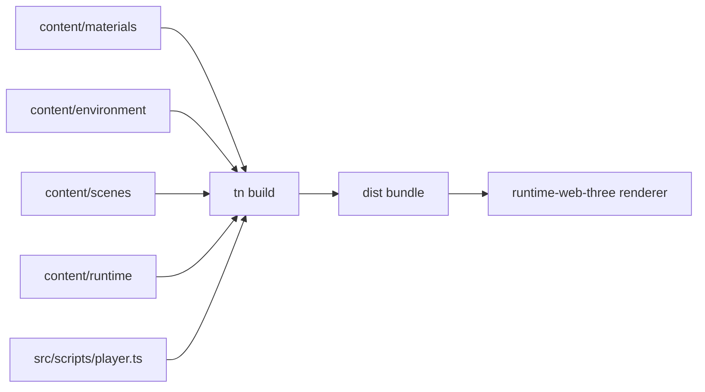

# PRD: UE-Quality Visual & Feel Polish — Humanoid Physics Course

`Planning Mode: Principal Architect`
`Complexity: 5 → MEDIUM mode`

## 1. Context

**Problem:** The humanoid physics course example plays correctly but reads as a
grey-box prototype; it should present like a small UE5-style third-person demo
(grounded PBR surfaces, filmic lighting, readable game feel).

**Files Analyzed:**

- `content/materials/arena.materials.json` — 8 flat materials, all sharing one
  `ue-test-surface.png` base color; no normal/roughness maps, no tiling.
- `content/environment/arena.environment.json` — sun + constant ambient,
  exponential fog, equirect sky/IBL from a tonemapped JPG, 2048 shadow map.
- `content/runtime/default.runtime.json` — MSAA4, bloom (0.22 / 0.82), ACES
  grading, `renderLook: balanced`, shadowQuality high.
- `content/scenes/arena.scene.json` — floor, walls, ramp, stairs, 2 crates,
  2 sweepers, 2 checkpoints, finish zone, soldier player.
- `content/ui/hud.ui.json`, `src/scripts/player.ts` (movement fixed; fixed
  chase camera, no orbit), `content/input/arena.input.json` (LookX axis bound
  to `pointer.deltaX` but unused).
- Engine capability check (`packages/runtime-web-three/src/render.ts`,
  `packages/ir/src/types.ts`): supports `normalTexture`, roughness/metalness/
  clearcoat maps, texture `repeat`/`wrapS`/`wrapT`, ACES tone mapping,
  UnrealBloomPass, color grading (exposure/contrast/saturation), PCFSoft
  shadows, equirect IBL with `reflection-and-irradiance` intent.

**Current Behavior:**

- Every surface shares one grid texture and albedo tint → no material identity.
- Soldier uses a flat grey placeholder material instead of the GLB's own maps.
- Lighting is serviceable but flat: constant ambient fights the IBL, shadows at
  2048 over 26 m are soft/blurry, fog color doesn't match the sky horizon.
- Camera is a fixed rear chase rig (no orbit, no look input), which reads as
  low-fi; checkpoint/hazard/finish feedback is HUD-text only.

## 2. Solution

**Approach:**

- Replace the shared grid texture with per-surface CC0 PBR sets (base color +
  normal + roughness) from ambientCG per
  `docs/workflows/open-source-3d-asset-kits.md`, with correct tiling.
- Let the Soldier GLB render its authored textures; reserve authored material
  overrides for course geometry only.
- Rebalance lighting: IBL-driven ambient, tighter/sharper shadow frustum,
  fog/sky/grading unified into one "overcast daylight" palette.
- Add pointer-driven camera orbit (LookX is already bound) with smoothed yaw,
  plus acceleration/deceleration on the character for weight.
- Upgrade moment-to-moment feedback: emissive pulse on the active checkpoint,
  hazard warning glow, finish celebration, `goal-ping.wav` on checkpoint/finish,
  HUD restyle.

**Key Decisions:**

- [x] Content-only where possible: all changes land in `content/**`,
      `src/scripts/**`, `assets/**`. No engine changes are required — every
      lever used below already exists in the web runtime.
- [x] Prefer `tn material ... --json` / `tn scene ... --json` authoring
      commands; direct JSON edits only where no CLI op exists (validated with
      `tn authoring validate --json`).
- [x] Textures: ambientCG CC0 (2K, JPG where alpha unneeded) — provenance
      recorded in `docs/asset-provenance.md` like the existing sky texture.
- [x] Error handling: every phase ends with the scene loop
      (`tn scene validate` → `tn scene proof` → `pnpm run build` →
      `pnpm run verify`); diagnostics are repaired in the owning durable file.

**Data Changes:** None (no schema changes; new texture asset entries in
`content/assets/arena.assets.json` only).

**Architecture (content pipeline):**



**Integration Points:**

- Entry point: `tn build` → `dist/humanoid-physics-course.bundle` → `tn dev
  --target web`. No new wiring; all phases modify documents already loaded by
  the bundle.
- User-facing: yes — every phase is visible in the running game.
- Full user flow: player opens dev server → sees relit PBR arena → moves with
  WASD/orbits with pointer → checkpoint/hazard/finish feedback fires visually,
  aurally, and in the HUD.

## 3. Execution Phases

#### Phase 1: Material identity — every surface reads as a distinct real-world material

**Files (max 5):**

- `assets/textures/` — add ambientCG sets (e.g. `Concrete042A` floor,
  `Concrete034` walls/edge, `Planks037B` crates, `PaintedMetal017` hazard/
  checkpoint trim); ~6–8 files at 2K.
- `content/assets/arena.assets.json` — register textures with `repeat`
  (`floor ≈ [6, 9]`, walls ≈ `[4, 1]`) and `wrapS`/`wrapT: "repeat"`.
- `content/materials/arena.materials.json` — per-material `baseColorTexture`,
  `normalTexture`, `roughnessTexture`; drop the shared grid; remove
  `mat.soldier.placeholder` tint so the GLB's own maps render (or set it to a
  neutral pass-through if the pipeline requires an entry).
- `docs/asset-provenance.md` — record source/license per set.

**Implementation:**

- [ ] Download + commit texture sets; register assets (`tn material ... --json`
      where the surface exists, JSON otherwise).
- [ ] Retune roughness/metalness per material (concrete 0.85–0.95 rough,
      planks ~0.8, painted metal ~0.45/metalness 0.6).
- [ ] Verify soldier renders its embedded textures, not the placeholder tint.

**Verification Plan:**

1. `tn authoring validate --json` + `tn scene validate arena --json` → no
   diagnostics.
2. `tn scene proof arena --project . --json` → screenshot shows distinct
   floor/wall/crate surfaces with visible normal response.
3. `pnpm run build && pnpm run verify` → `"status": "pass"`.

**User Verification:** Walk the course — floor, walls, crates, and hazards are
visually distinct materials with texture detail at glancing angles.

#### Phase 2: Lighting, shadows, atmosphere — one coherent daylight palette

**Files (max 5):**

- `content/environment/arena.environment.json`
- `content/runtime/default.runtime.json`

**Implementation:**

- [ ] Shadows: `mapSize: 4096`, `maxDistance: 20` (course is ~18 m long),
      re-tune `bias`/`normalBias` against acne/peter-panning.
- [ ] Drop constant ambient intensity to ≤ 0.12 and raise `environmentMap.
      intensity` to ~0.55 so the IBL drives fill; sun intensity rebalanced
      (~4.5–5.5) so ACES highlights don't clip on the floor.
- [ ] Unify palette: fog color ≈ sky horizon color; slight exposure bump if
      needed (grading, not sun).
- [ ] Runtime: keep MSAA4; bloom `threshold ≈ 0.9`, `intensity ≈ 0.18` so only
      emissives bloom; contrast ~0.08, saturation ~1.0.

**Verification Plan:**

1. Scene loop passes (validate/proof/build/verify).
2. Proof screenshot: crisp contact shadows under crates and soldier, no
   visible shadow acne, sky/fog/floor read as one scene.

**User Verification:** Shadow edges are sharp near the player; nothing blooms
except checkpoint/hazard emissives; horizon fog blends into the sky.

#### Phase 3: Camera orbit + character weight — third-person feel

**Files (max 5):**

- `src/scripts/player.ts` (both systems)
- `content/input/arena.input.json` (LookX already bound; add LookY if vertical
  orbit is wanted)

**Implementation:**

- [ ] `updateThirdPersonCamera`: read `context.input.axis("LookX")` (pointer
      deltaX), accumulate `cameraYaw` in GameState, orbit the boom
      (distance 4.15, height 1.82) around the player by yaw with the existing
      exponential smoothing; clamp yaw rate.
- [ ] Movement becomes camera-relative: rotate `(moveX, moveZ)` by `cameraYaw`
      in `updateHumanoidCourse` before `character.move`.
- [ ] Character weight: accelerate current planar speed toward target
      (walk 1.92 / sprint 3.66 m/s) at ~10 m/s², decelerate at ~14 m/s²;
      keep the existing yaw-follow (already lerped at 14/s).
- [ ] Animation: scale playback `speed` by actual speed / clip reference speed
      to kill foot sliding at accel/decel boundaries.

**Verification Plan:**

1. `tn playtest --project . --entity player --press KeyW --frames 90
   --expect-moved --expect-axis z --json` → pass (regression guard).
2. Repeat for `KeyA`/`KeyD`/`KeyS`; build + verify pass.
3. Manual: orbit with pointer, run a full lap — camera never pops, character
   eases in/out of movement.

**User Verification:** Drag pointer → camera orbits smoothly; W after orbit
moves the character away from camera; starts/stops feel weighted, feet don't
slide.

#### Phase 4: Gameplay feedback — checkpoints, hazards, finish

**Files (max 5):**

- `content/scenes/arena.scene.json` (emissive trim entities / marker rings)
- `content/materials/arena.materials.json` (pulse-capable emissive materials)
- `src/scripts/player.ts` (drive emissive pulse + audio via patches)
- `content/ui/hud.ui.json`

**Implementation:**

- [ ] Active checkpoint ring pulses emissive (sin-driven `emissiveIntensity`
      patch, 0.2→1.0); cleared checkpoints drop to a dim steady state.
- [ ] Sweeper hazards get a red emissive strip + brief full-scene-safe flash
      of the hazard material on hit (no screen-space effects needed).
- [ ] Play `asset.goal-ping` on checkpoint clear and finish (existing audio
      asset; use the runtime audio service the assets doc already registers).
- [ ] HUD: split the single `hudLine` into styled checkpoint / timer / hits
      fields; add a fade-in "COURSE COMPLETE — R to restart" banner.

**Verification Plan:**

1. Scene loop passes.
2. `tn game qa --project . --run-proof --json` → no regressions.
3. Manual: clear CP1 → ring dims + ping sounds + HUD increments; touch sweeper
   → hit flash + counter (max 1 per 0.8 s); finish → banner + ping.

**User Verification:** Every game event has a simultaneous visual, audio, and
HUD response.

#### Phase 5: Final grade + performance gate

**Files (max 5):**

- `content/runtime/default.runtime.json`
- `content/environment/arena.environment.json` (final nudges only)

**Implementation:**

- [ ] Final grading pass against reference screenshots (UE5 third-person
      template as the bar): exposure/contrast/saturation micro-tuning.
- [ ] Confirm 60 fps at 1280×720 with MSAA4 + bloom + 4096 shadows on the dev
      machine; if not, step shadow `mapSize` to 2048 and document the tradeoff.
- [ ] `pnpm run game:score` and record the score delta in this PRD.

**Verification Plan:**

1. Full scene loop + `pnpm run verify` pass.
2. `tn game qa --project . --run-proof --json` pass.
3. Before/after proof screenshots committed under `artifacts/game-production/`.

**User Verification:** Side-by-side before/after screenshots show a clear
quality jump; game holds 60 fps.

## 4. Checkpoint Protocol

After each phase, spawn the automated reviewer:

```
Task(subagent_type: "prd-work-reviewer",
     prompt: "Review checkpoint for phase N of PRD at
              examples/humanoid-physics-course/docs/PRDs/ue-quality-polish.md")
```

Phases 1, 2, 3, and 5 are visual → **automated + manual** checkpoint (proof
screenshot review). Phase 4 adds audio → manual listen check.

## 5. Acceptance Criteria

- [ ] All 5 phases complete; every phase's scene loop green
      (`tn scene validate` / `proof` / `pnpm run build` / `pnpm run verify`).
- [ ] `tn playtest` movement regressions pass for W/A/S/D after Phase 3.
- [ ] No shared placeholder texture remains in `arena.materials.json`.
- [ ] Soldier renders its authored GLB materials.
- [ ] All new textures CC0 with provenance recorded.
- [ ] 60 fps at 1280×720; `tn game qa --run-proof` passes.
- [ ] Feature reachable end-to-end via `tn dev --target web` (no orphaned
      content).

## Verification Evidence

_(fill in per phase during execution)_
